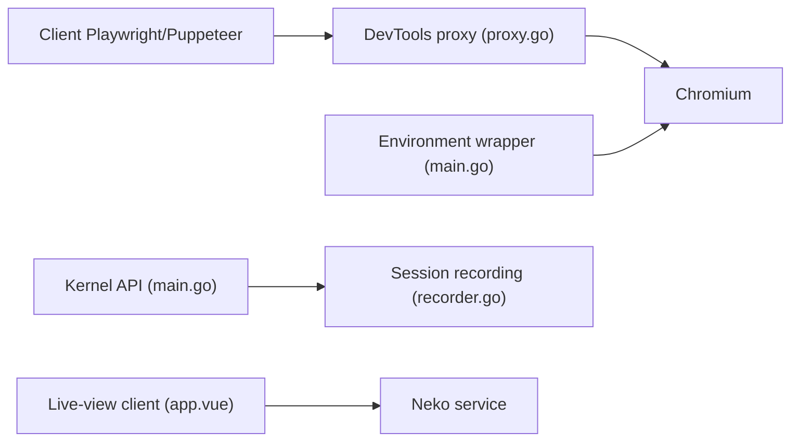

# kernel/kernel-images

> Images Chrome sandboxées, avec vue en direct et replay, pour agents web et automatisations navigateur.

## Le problème
Les agents qui pilotent un navigateur ont besoin d'un Chrome isolé, observable et rejouable, que Playwright ou Puppeteer puissent atteindre à distance.

## Ce que ça fait vraiment
Fait tourner Chromium avec interface dans Docker ou sur un unikernel Unikraft. Expose le port CDP 9222, une vue en direct (noVNC ou WebRTC) et un enregistrement vidéo H.264 via une API locale. L'unikernel ajoute veille automatique et restauration d'état.

## Comment c'est branché


## Essayer
```bash
cd images/chromium-headful
IMAGE=kernel-docker ./build-docker.sh
IMAGE=kernel-docker ENABLE_WEBRTC=true ./run-docker.sh
```

## Coût et pièges
Gratuit en local ; l'unikernel exige au moins 8 Go de mémoire et un compte Unikraft. L'URL de vue en direct est publique : ne pas y mettre de contenu sensible. Audio WebRTC non fonctionnel.

## Ce que ce n'est pas
Pas un framework d'agent ni un client d'automatisation : c'est le navigateur et son enveloppe. Le dépôt alimente leur service hébergé.

## Alternatives
Aucune alternative nommée dans le README.

## Pour toi
À surveiller : brique pratique pour donner un navigateur à un agent, mais seulement si tu en as vraiment besoin ; le service hébergé reste l'option commerciale.

