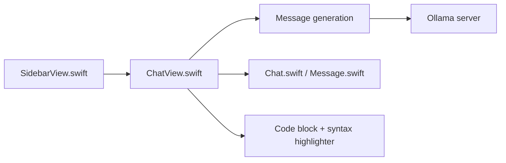

# kevinhermawan/Ollamac

> Client de chat natif macOS pour un serveur Ollama local, avec coloration syntaxique.

## Le problème
Dialoguer avec ses modèles Ollama sans passer par le terminal.

## Ce que ça fait vraiment
Appli SwiftUI qui se connecte à un hôte Ollama configurable, liste les modèles installés, enregistre chats et messages dans SwiftData, affiche les réponses en Markdown avec coloration de code. Invite système et préférences par discussion.

## Comment c'est branché


## Essayer
```bash
brew install --cask ollamac
```

## Coût et pièges
Gratuit. Exige macOS 14 et Ollama installé avec au moins un modèle. Dernier push en mars 2025 ; licence non identifiée par GitHub. Des apps commerciales homonymes existent : ne télécharger que depuis le dépôt officiel.

## Ce que ce n'est pas
Pas un serveur de modèles ni multi-plateforme : macOS uniquement.

## Alternatives
Aucune alternative nommée dans le README.

## Pour toi
À ignorer sauf besoin d'un client Mac minimal : peu maintenu depuis mars 2025, licence floue.

