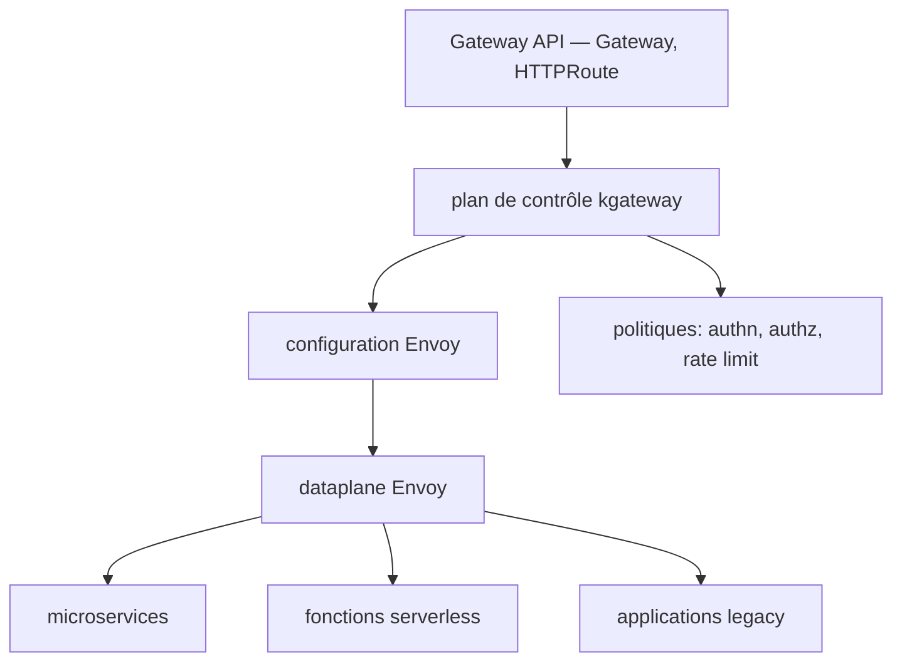

# kgateway-dev/kgateway

> Plan de contrôle Envoy implémentant la Gateway API Kubernetes pour exposer des services.

## Le problème
Exposer des API sur Kubernetes en appliquant authentification, autorisation et limitation de débit se fait d'ordinaire à trois endroits différents.
Migrer une application historique vers des microservices impose de router vers les deux en même temps.

## Ce que ça fait vraiment
Il implémente la Gateway API Kubernetes au-dessus d'Envoy, du micro-gateway entre services jusqu'au gateway centralisé traitant des milliards d'appels.
Il applique les politiques — authentification, autorisation, rate limiting — au même endroit que la description des routes.
Il route vers des backends hétérogènes : microservices, fonctions serverless ou applications historiques, ce qui permet une migration progressive.
La délégation de routes et les politiques composables donnent à plusieurs équipes le moyen d'exprimer leurs API dans un même cluster.

## Comment c'est branché


## Essayer
Aucune commande d'installation n'est présente dans le README : il renvoie vers la documentation du projet et vers `devel/contributing/releasing.md` pour le processus de publication.

```bash
# aucune commande documentée dans le README — voir la documentation kgateway
```

## Coût et pièges
Gratuit, mais il faut un cluster Kubernetes et accepter Envoy comme dataplane.
Attention au changement de périmètre : depuis la 2.3.0, le plan de contrôle d'agentgateway a été déplacé dans le dépôt agentgateway — les fonctions IA et agentiques ne sont plus ici.

## Ce que ce n'est pas
Ce n'est plus une passerelle IA : le README l'indique explicitement, kgateway se recentre sur le rôle d'API Gateway Envoy.
Ce n'est pas un projet neuf non plus : c'est Gloo, lancé en 2018 par Solo.io, renommé — les superlatifs de tête viennent du projet, pas d'une mesure.

## Alternatives
- agentgateway : cité comme le dépôt qui porte désormais le plan de contrôle des cas IA et agentiques.
- Gloo : l'ancien nom, avec un plan de migration documenté.

## Pour toi
Hors sujet direct pour la data/IA depuis le départ d'agentgateway ; c'est ce dernier dépôt qu'il faut suivre.
