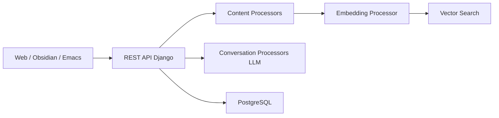

# khoj-ai/khoj

> Assistant IA personnel qui interroge tes documents et le web, local ou en cloud.

## Le problème
Interroger ses propres notes (PDF, Markdown, org-mode, Notion) avec un LLM sans tout copier-coller.

## Ce que ça fait vraiment
Backend Django + PostgreSQL : ingestion de documents par type, embeddings et recherche sémantique, chat avec LLM locaux ou distants (OpenAI, Anthropic, Google…), agents personnalisés, automatisations (newsletters, notifications), génération d'images. Clients web, Obsidian, Emacs, bureau, mobile, WhatsApp. L'architecture mentionne un système de télémétrie.

## Comment c'est branché

## Essayer
Aucune commande dans le README : auto-hébergement renvoyé vers la documentation, version cloud sur app.khoj.dev.

## Coût et pièges
Cloud freemium, offre entreprise ; auto-hébergé, clé d'API LLM ou modèle local à fournir. Télémétrie évoquée par l'architecture, non détaillée dans le README.

## Ce que ce n'est pas
Pas un framework RAG à intégrer dans ton code ; c'est une application complète.

## Alternatives
Aucune nommée (Pipali est un autre produit de l'équipe).

## Pour toi
Candidat pour un « second cerveau » perso auto-hébergé ; vérifie la télémétrie avant.
