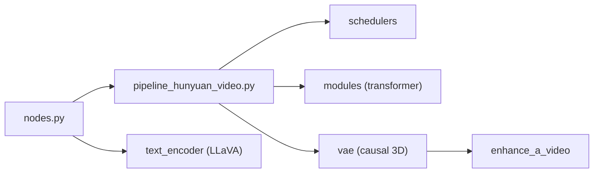

# kijai/ComfyUI-HunyuanVideoWrapper

> Nœuds ComfyUI pour HunyuanVideo, aujourd'hui surtout utiles pour tester des fonctions absentes de l'implémentation native.

## Le problème
Faire tourner HunyuanVideo dans ComfyUI avant que l'implémentation native n'existe, avec des optimisations mémoire et des modes de génération supplémentaires.

## Ce que ça fait vraiment
Un paquet de nodes (`nodes.py`, `nodes_rf_inversion.py`) qui embarque le runtime `hyvideo/` : pipeline de diffusion, transformer, schedulers (DPM-Solver, FlowMatch, SA-Solver, UniPC), encodeur texte LLaVA, VAE 3D causal et option FP8. Il ajoute IP2V (image comme partie du prompt), I2V officiel, LoRAs, inversion vidéo et Enhance-A-Video, avec des workflows d'exemple.

## Comment c'est branché

## Essayer
Le README ne donne pas de commande d'installation. Il liste les emplacements de poids : diffusion_models et vae de ComfyUI, `ComfyUI/models/LLM/llava-llama-3-8b-text-encoder-tokenizer` et `ComfyUI/models/clip/clip-vit-large-patch14`.

## Coût et pièges
Poids à télécharger depuis Hugging Face. La mémoire dépend de la résolution et du nombre d'images : le README prévient de ne pas viser haut même avec 24 Go. Aucune licence déclarée pour le dépôt.

## Ce que ce n'est pas
L'auteur écrit qu'il arrête presque de travailler dessus, l'implémentation native de ComfyUI couvrant l'essentiel. Manquent encore au natif : fenêtrage de contexte, IP2V direct, gestion manuelle de la mémoire. Dernier push en août 2025, 299 issues ouvertes.

## Alternatives
- Implémentation native de ComfyUI : couvre la plupart des fonctions.
- ComfyUI-HunyuanLoom : FlowEdit et Enhance-a-video en natif.
- Comfy-WaveSpeed : FirstBlockCache et torch.compile avec LoRA.

## Pour toi
À ignorer : l'auteur l'a mis en retrait au profit du natif, et l'absence de licence rend toute réutilisation risquée.

