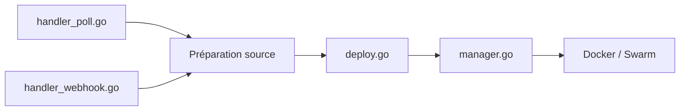

# kimdre/doco-cd

> Outil GitOps léger qui déploie des projets Docker Compose et stacks Swarm depuis Git, pour les auto-hébergeurs.

## Le problème
Mettre à jour à la main des Compose sur plusieurs hôtes est répétitif ; Portainer ou ArgoCD sont lourds pour ce besoin.

## Ce que ça fait vraiment
Surveille un dépôt Git (ou un artefact OCI) par polling ou webhook, prépare la source, puis réconcilie le déploiement vers Docker ou Swarm. Gère des secrets externes et le chiffrement SOPS, plusieurs hôtes via Docker Contexts, des fenêtres de synchronisation, des tâches planifiées, des scripts pré/post-déploiement, notifications et métriques Prometheus, avec API REST et serveur MCP.

## Comment c'est branché

## Essayer
Le README ne documente aucune commande d'installation : tout renvoie à la documentation sur doco.cd.

## Coût et pièges
Gratuit, image distroless à faible empreinte. Demande l'accès au socket Docker de l'hôte ; la configuration est dans la doc externe, non résumée ici.

## Ce que ce n'est pas
Pas un orchestrateur Kubernetes : cible Compose et Swarm. Pas une interface graphique comme Portainer.

## Alternatives
- Portainer et ArgoCD : cités comme les références que l'outil simplifie.

## Pour toi
À adopter si tu déploies des Compose depuis Git sur ton propre serveur : actif (push de septembre 2026), Apache-2.0, périmètre clair.

