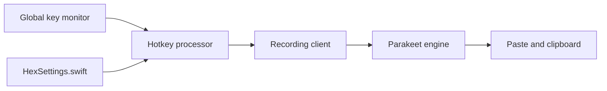

# kitlangton/Hex

> Ancienne appli macOS de dictée vocale : maintenue en archive, remplacée par une version Rust ailleurs.

## Le problème
Dicter du texte dans n'importe quelle application sans passer par un service cloud.

## Ce que ça fait vraiment
Un raccourci global : on maintient la touche, on parle, on relâche, et la transcription est collée dans l'application active. Double-tap pour verrouiller l'enregistrement. Transcription locale via Parakeet TDT v3 (FluidAudio) et WhisperKit, Apple Silicon uniquement. Historique, remappage de mots et téléchargement de modèles inclus. Le dépôt ne conserve que la version Swift ; l'auteur a réécrit Hex en Rust (anomalyco/hex).

## Comment c'est branché


## Essayer
```bash
brew install --cask kitlangton-hex
```

## Coût et pièges
Gratuit. Autorisations micro et accessibilité à accorder. Apple Silicon requis.

## Ce que ce n'est pas
Pas la version actuelle : le README renvoie vers le nouveau dépôt Rust. Pas disponible hors macOS.

## Alternatives
anomalyco/hex (réécriture Rust, citée dans le README).

## Pour toi
À ignorer : la version active est ailleurs et ce dépôt ne sert plus qu'à préserver l'historique Swift.

