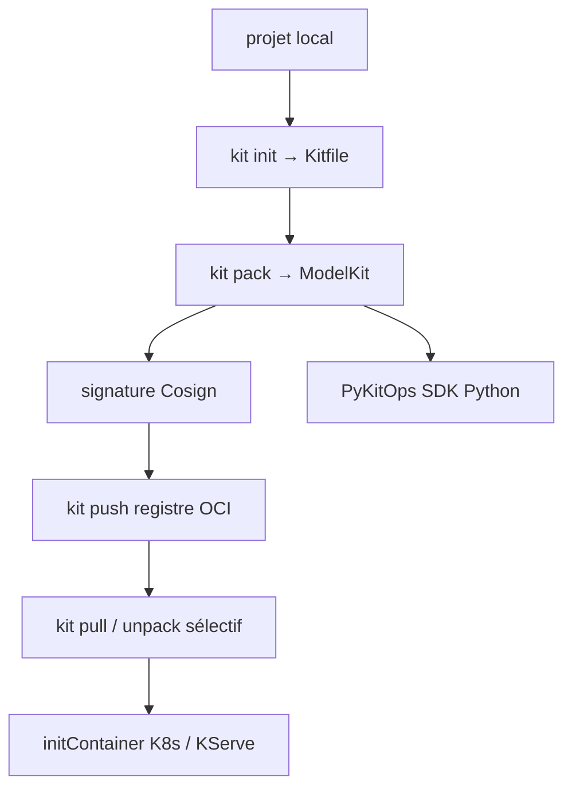

# kitops-ml/kitops

> Empaquette modèles, jeux de données, code et configuration en artefacts OCI versionnés et signables.

## Le problème
Les poids d'un modèle, ses données, ses prompts et sa configuration vivent dans des endroits différents et se désynchronisent.
Rien ne garantit, au moment du déploiement, que l'ensemble correspond bien à la version validée.

## Ce que ça fait vraiment
Emballe le projet en **ModelKit** : un paquet immuable, en couches, stocké dans un registre de conteneurs existant.
Chaque composant est haché en SHA-256, l'artefact est signable avec Cosign (clé ou OIDC sans clé), et un paquet altéré est rejeté au pull.
Le dépaquetage est sélectif : on peut ne tirer que le modèle, ou que le jeu de données.
Le `Kitfile` décrit où vit chaque artefact et se génère avec `kit init` ; le format ModelPack de la CNCF est géré de manière transparente par les mêmes commandes.

## Comment c'est branché


## Essayer
```bash
kit init .
kit pack
kit push
kit inspect
kit diff
```

## Coût et pièges
Aucun service à payer : le stockage réutilise le registre de conteneurs déjà en place.
Jozu Hub, cité dans le README, est un produit séparé avec administration centralisée et scan en cinq couches — il n'est pas nécessaire pour utiliser KitOps.

## Ce que ce n'est pas
Pas un registre : KitOps produit et lit des artefacts, le stockage reste celui de l'organisation.
Pas un outil de suivi d'expériences : l'intégration MLflow sert à empaqueter un run, pas à le remplacer.
Les propriétés annoncées pour l'EU AI Act ou ISO 42001 sont des briques d'intégrité et de traçabilité, pas une conformité livrée.

## Alternatives
- ModelPack : la spécification CNCF neutre, que KitOps implémente plutôt que de la concurrencer.

## Pour toi
C'est le maillon qui manque entre un modèle validé et un déploiement traçable — à tester sur un modèle réel avant d'en faire une règle d'équipe.
