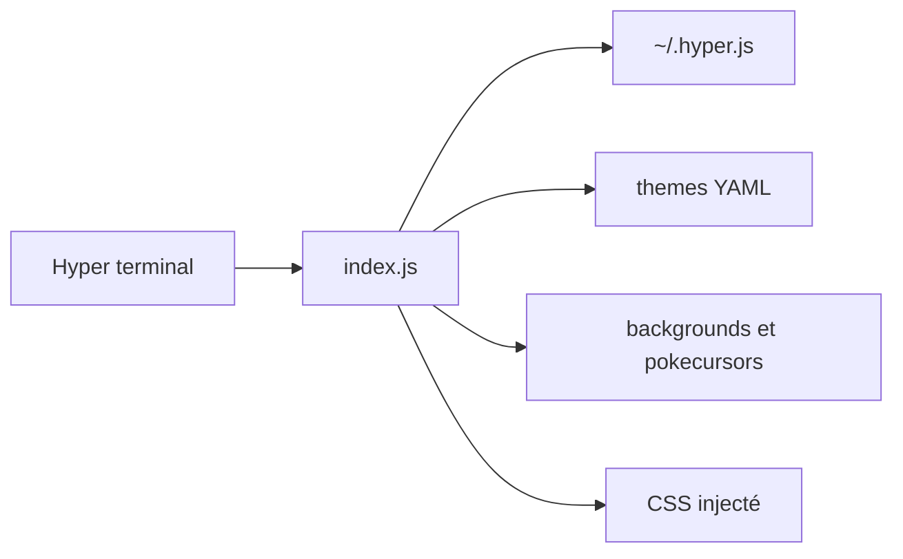

# klaudiosinani/hyper-pokemon

> Thèmes Pokémon pour le terminal Hyper : fond, couleurs de syntaxe et onglet animé.

## Le problème
Personnaliser un terminal Hyper avec un thème à l'effigie de ses Pokémon préférés.

## Ce que ça fait vraiment
Un plugin qui lit `~/.hyper.js` (options `pokemon`, `unibody`, `poketab`) et injecte fond et couleurs du thème, choisi par nom, type, dresseur, au hasard ou parmi une liste. Les thèmes viennent de fichiers YAML et d'images du dépôt.

## Comment c'est branché


## Essayer
```bash
hyper i hyper-pokemon
```
Puis ajouter `pokemon: 'gengar'` dans la section `config` de `~/.hyper.js`.

## Coût et pièges
Gratuit. Les fonds ont été créés par des artistes tiers (Teej/TopHat, MapleRose, Ferretdayo) : leurs droits ne sont pas détaillés. L'option `poketab` est désactivée par défaut.

## Ce que ce n'est pas
Ce n'est pas un terminal ni un outil de productivité ; les thèmes n'apportent rien de fonctionnel.

## Alternatives
- Hyperocean : thème bleu océan pour Hyper.
- Hyper Star Wars : thèmes Star Wars pour Hyper.

## Pour toi
Ignorer : simple habillage de terminal, sans effet sur un travail data ou IA.

