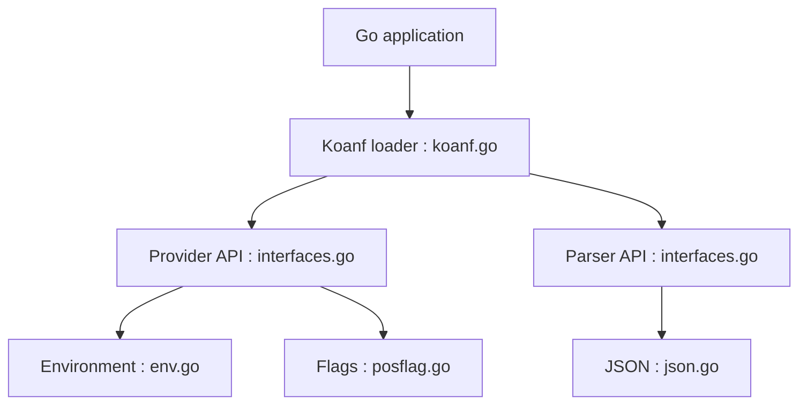

# knadh/koanf

> Bibliothèque Go de lecture de configuration depuis plusieurs sources et formats, alternative plus légère à viper.

## Le problème
Viper force une casse minuscule des clés, couple le parsing aux extensions et tire beaucoup de dépendances.

## Ce que ça fait vraiment
Deux interfaces : Provider (fichier, variables d'environnement, flags, S3, Vault, Consul, etcd, maps, structs…) et Parser (JSON, YAML, TOML, HCL, dotenv…). On charge et fusionne dans l'ordre voulu, puis on lit par chemin de clés (`app.server.port`), on désérialise en structs ou on resérialise. Dépendances installées séparément du cœur.

## Comment c'est branché


## Essayer
```bash
go get -u github.com/knadh/koanf/v2
go get -u github.com/knadh/koanf/providers/file
go get -u github.com/knadh/koanf/parsers/toml
```

## Coût et pièges
Gratuit. La surveillance de fichier n'est pas sûre en concurrence sans verrou. Les clés sont sensibles à la casse. Le fusionnement strict peut échouer entre JSON et YAML (entiers/flottants).

## Ce que ce n'est pas
Pas un framework d'application ni un gestionnaire de secrets : il lit et fusionne de la configuration.

## Alternatives
- spf13/viper : plus répandu, mais critiqué par le README pour casse, dépendances et couplage.

## Pour toi
À surveiller : bon choix si tu écris des services Go configurables ; sans objet pour du Python.

