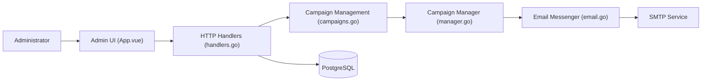

# knadh/listmonk

> Gestionnaire de newsletters et listes de diffusion auto-hébergé, binaire unique sur PostgreSQL.

## Le problème
Les services d'emailing hébergés facturent au contact et gardent tes listes. S'en passer suppose de bricoler envoi, désinscription et rebonds soi-même.

## Ce que ça fait vraiment
Une application Go avec interface Vue gère listes, abonnés, templates, médias et campagnes.
Le campaign manager découpe les abonnés en lots, rend les messages et les envoie par SMTP.
Des formulaires publics collectent les inscriptions ; les rebonds reviennent via des intégrations dédiées.
Les médias sont stockés sur disque ou S3.

## Comment c'est branché


## Essayer
```bash
curl -LO https://github.com/knadh/listmonk/raw/master/docker-compose.yml
docker compose up -d
./listmonk --new-config
./listmonk --install
./listmonk
```

## Coût et pièges
Logiciel gratuit, mais il te faut un serveur SMTP (et sa facture/réputation d'envoi) et une base PostgreSQL.

## Ce que ce n'est pas
Pas un service d'envoi : la délivrabilité dépend de ton SMTP. AGPLv3 : modifier et exposer le service oblige à publier les sources. Porté principalement par une personne.

## Alternatives
Aucune alternative nommée dans le README.

## Pour toi
À ignorer côté data/IA : outil marketing solide mais hors de ton périmètre, sauf besoin ponctuel d'envoyer des rapports par email.
