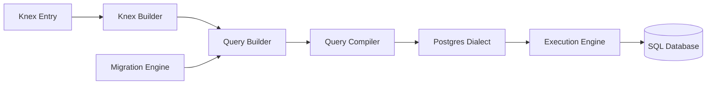

# knex/knex

> Constructeur de requêtes SQL multi-dialectes pour Node.js, avec migrations et transactions.

## Le problème
Écrire du SQL brut couplé à un seul moteur complique portabilité, migrations de schéma et composition dynamique des requêtes en JavaScript.

## Ce que ça fait vraiment
API chaînable qui construit des requêtes, compilées vers PostgreSQL, MySQL/MariaDB, CockroachDB, MSSQL, SQLite3 ou Oracle.
Pool de connexions, transactions, requêtes en streaming, API promesses et callbacks.
Moteur de migrations et de seeds via CLI.
Typage TypeScript, import ESM ou CommonJS.

## Comment c'est branché


## Essayer
```bash
npm install
pip install setuptools
```
(Commandes de mise en place du développement ; le README ne donne pas de `npm install knex` explicite.)

## Coût et pièges
Gratuit. Construire `better-sqlite3` demande Python avec `setuptools`, et sous Windows les Build Tools C++.

## Ce que ce n'est pas
Pas un ORM : pour cela le README renvoie à d'autres projets. Pas un outil Python.

## Alternatives
- objection.js : ORM bâti sur knex.
- mikro-orm : ORM basé sur knex.
- Bookshelf : ORM historique sur knex.

## Pour toi
À ignorer : excellent dans l'écosystème Node, mais sans usage dans une pile data Python où SQLAlchemy occupe cette place.
