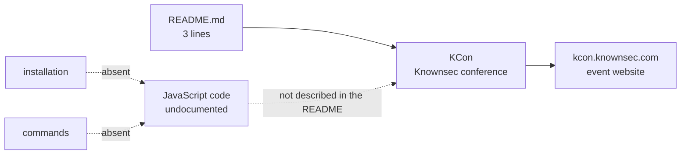

# knownsec/KCon

> **Showcase repository for a Chinese security conference, with no usable code or documentation.**

## The problem

The README states no technical problem. It announces a hacker conference run by the Knownsec
team and points to `http://kcon.knownsec.com/`. With that little material, there is no way to
say what cloning this repository would solve for anyone.

## What it actually does

The README is three lines long and makes two claims: KCon is a hacker con powered by the
Knownsec team, and its site is `http://kcon.knownsec.com/`. No feature, no module and no file
is documented. The catalogue records JavaScript as the language, but the README explains
neither what that code does nor how to run it. The 4651 stars most likely reflect the
reputation of the event — past editions' slides are typically dropped in such repositories —
rather than any documented software use here.

## How it is wired



No code-derived diagram exists for this repository, and the README does not allow a faithful
one to be rebuilt: this sketch only shows what the README contains and what it leaves out.

## Trying it

The README documents **no command at all**: no clone, no install, no run, no build. There is
nothing to copy, and reconstructing a command would mean inventing it.

```bash
# No command is documented in the README.
# The only entry point mentioned: http://kcon.knownsec.com/
```

## Cost and gotchas

No cost is documented: no API key, no GPU, no Docker, no third-party service, no account, no
quota. The real catch lies elsewhere: no licence is declared, so nothing is legally reusable by
default, and the only pointer is an external plain-HTTP website whose availability and content
are outside the repository's control.

## What it is not

This is not a tool, a library or a project to integrate: nothing in the README describes an
interface, an API or an entry point. It is not usable documentation either — three lines and a
link are not a resource. The star count measures the fame of a conference, not the value of a
piece of software, and that is the main misunderstanding to avoid.

## Alternatives

No comparable alternative in the catalogue: the README names no other repository, no neighbours
were supplied with this slug, and an event showcase repository has no functional equivalent to
offer.

## For you

Skip it. For a data / AI / MLOps profile there is nothing to take away: no documented code, no
licence, no command. If the topic interests you, go straight to the conference website rather
than cloning this repository.
