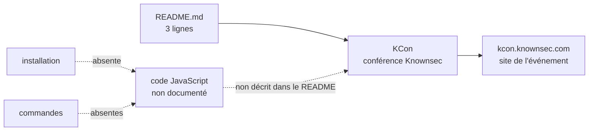

# knownsec/KCon

> **Dépôt vitrine d'une conférence de sécurité chinoise, sans code ni documentation exploitable.**

## Le problème

Le README ne décrit aucun problème technique : il annonce une conférence de hackers organisée
par l'équipe Knownsec et renvoie vers `http://kcon.knownsec.com/`. Sans plus de matière, on ne
peut pas dire ce que ce dépôt résoudrait à quelqu'un qui le clonerait.

## Ce que ça fait vraiment

Le README tient en trois lignes et se limite à deux affirmations : KCon est une conférence de
hackers portée par l'équipe Knownsec, et son site est `http://kcon.knownsec.com/`. Aucune
fonctionnalité, aucun module, aucun fichier n'est documenté. Le langage déclaré côté catalogue
est JavaScript, mais le README n'explique ni ce que fait ce code, ni comment l'exécuter. Les
4651 étoiles s'expliquent vraisemblablement par la notoriété de l'événement (les supports des
éditions passées y sont généralement déposés), pas par un usage logiciel documenté ici.

## Comment c'est branché



Aucun diagramme tiré du code n'existe pour ce dépôt, et le README ne permet pas d'en
reconstruire un fidèle : ce schéma dit seulement ce que le README contient et ce qu'il
n'expose pas.

## Essayer

Le README ne documente **aucune commande** : ni clonage, ni installation, ni exécution, ni
build. Il n'y a rien à copier ici, et reconstruire une commande serait l'inventer.

```bash
# Aucune commande n'est documentée dans le README.
# Seul point d'entrée cité : http://kcon.knownsec.com/
```

## Coût et pièges

Aucun coût documenté : pas de clé d'API, pas de GPU, pas de Docker, pas de service tiers, pas
de compte à créer, pas de quota. Le vrai piège est ailleurs : la licence est absente du dépôt,
donc aucune réutilisation n'est juridiquement autorisée par défaut, et le seul contenu pointé
est un site web externe en HTTP simple, dont la disponibilité et le contenu échappent au dépôt.

## Ce que ce n'est pas

Ce n'est pas un outil, une bibliothèque ni un projet à intégrer : rien dans le README ne
décrit une interface, une API ou un point d'entrée. Ce n'est pas non plus une documentation
utilisable — trois lignes et un lien ne constituent pas une ressource. Le nombre d'étoiles
mesure ici la notoriété d'une conférence, pas la valeur d'un logiciel : c'est le malentendu
principal à éviter.

## Alternatives

Aucune alternative comparable dans le catalogue : le README ne nomme aucun autre dépôt, aucun
voisin n'a été fourni avec ce slug, et un dépôt vitrine d'événement n'a pas d'équivalent
fonctionnel à proposer.

## Pour toi

Passe ton chemin. Pour un profil data / IA / MLOps, il n'y a strictement rien à en tirer : pas
de code documenté, pas de licence, pas de commande. Si le sujet t'intéresse, va directement sur
le site de la conférence plutôt que de cloner ce dépôt.
