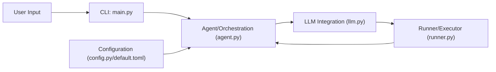

# knownsec/aipyapp

> Client en ligne de commande où un LLM écrit et exécute du Python pour accomplir une tâche décrite en langage naturel.

## Le problème
Enchaîner appels d'API, scripts et bibliothèques pour une tâche ponctuelle demande de coder soi-même chaque étape, ou d'installer plusieurs outils d'agents.

## Ce que ça fait vraiment
Tu décris une tâche ; le LLM planifie, génère du Python, l'exécute sur ta machine, lit le résultat et corrige jusqu'au bout. Deux modes : tâche (par défaut) et Python (`--python`, avec la fonction `ai("…")`). Quand le code a besoin d'une bibliothèque tierce, l'outil demande confirmation (`y/n`) avant de l'installer. La configuration se fait dans `~/.aipyapp/aipyapp.toml`. D'après le code : `agent.py`, `llm.py`, `runner.py`.

## Comment c'est branché


## Essayer
```bash
pip install aipyapp
aipy
aipy --python
```
Le fichier `~/.aipyapp/aipyapp.toml` doit déclarer un fournisseur, par exemple `[llm.deepseek]` avec `type` et `api_key`.

## Coût et pièges
Tu paies les appels au LLM choisi (clé d'API). Le code généré s'exécute dans ton environnement réel : le README présente cela comme un atout et ne décrit aucun bac à sable. Licence présente mais non identifiée par GitHub. Version affichée 0.1.22 : jeune.

## Ce que ce n'est pas
Ce n'est pas un générateur de code ni un IDE, selon le README : le résultat compte, pas le code. Le manifeste (« pas d'agents, pas de MCP ») est une position de l'auteur, pas une preuve de supériorité ; aucune mesure n'est fournie.

## Alternatives
Aucune alternative citée dans le README (il ne nomme que les approches qu'il rejette : appel de fonctions, MCP, workflows).

## Pour toi
À surveiller : l'idée de laisser le modèle piloter un interpréteur est intéressante pour l'exploration de données, mais exécuter du code généré sans isolation sur ta machine impose de le tester dans un conteneur.
