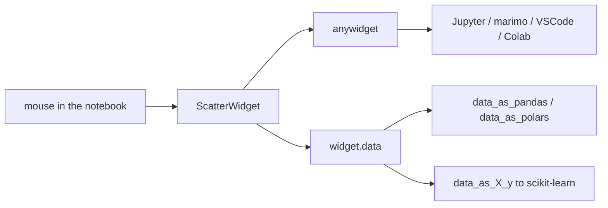

# koaning/drawdata

> **A notebook widget for drawing a dataset with the mouse and reading it back as a DataFrame.**

## The problem

Illustrating a machine learning algorithm needs a dataset with a chosen shape: two moons, a
noisy blob, a twisted boundary. Without a tool, you generate it in code and iterate blindly
instead of drawing the shape you have in mind.

## What it actually does

The package provides widgets to instantiate inside a notebook, among them `ScatterWidget`,
which opens a drawing area. You place points with the mouse, optionally in several colors.
The drawn points are then readable from Python: `widget.data` returns a list of dictionaries,
`widget.data_as_pandas` and `widget.data_as_polars` return a DataFrame, and
`widget.data_as_X_y` returns the `X, y` pair scikit-learn expects. The README states the
convention behind that last property: several colors mean classification, a single color
means regression, and `y` then refers to the y-axis. The drawing can be updated and read back
during the session; the README links a video where each edit retrains a scikit-learn model.

## How it is wired



No code-derived diagram exists for this repository; the graph above is built from the README.
The central piece is `anywidget`, which acts as the rendering layer and explains the stated
compatibility with marimo, Jupyter, VSCode and Colab, plus interoperability with `ipywidgets`.

## Trying it

```
uv pip install drawdata
```

```python
from drawdata import ScatterWidget

widget = ScatterWidget()
widget
```

```python
# Get the drawn data as a list of dictionaries
widget.data

# Get the drawn data as a dataframe
widget.data_as_pandas
widget.data_as_polars
```

```
X, y = widget.data_as_X_y
```

The README also mentions an online demo page that requires no installation.

## Cost and gotchas

Nothing to pay, no API key, no account: the package installs with pip and runs locally. The
real prerequisite is a notebook environment compatible with `anywidget` — the README cites
marimo, Jupyter, VSCode and Colab, without naming a minimum Python version or a dependency
list. `data_as_pandas` and `data_as_polars` assume pandas or polars are installed on your
side, which the README does not spell out. The classification/regression convention of
`data_as_X_y` is implicit: drawing a single color silently changes the meaning of `y`.

## What it is not

It is not a realistic synthetic-data generator nor an augmentation tool: points come from the
hand, not from a parameterised distribution, and nothing guarantees one drawing reproduces
another. It is also not an annotation tool or a dataset editor: you draw two-dimensional
points, you do not load a file to fix it. The README itself calls it a small library, aimed
mainly at teaching and demonstration.

## Alternatives

No comparable alternative in the catalogue: the suggested neighbours, ruc-datalab/DeepAnalyze
and StructuredLabs/preswald, belong to data analysis and data apps, not to interactive
drawing of a point set. The only neighbouring project named in the README is `anywidget`,
which is the underlying building block rather than a competitor.

## Why it matters to you

Useful if you teach or demonstrate models: producing a twisted boundary in ten seconds and
handing it to scikit-learn beats tuning a `make_moons` call by trial and error. For work on
real data, the tool has no role.
