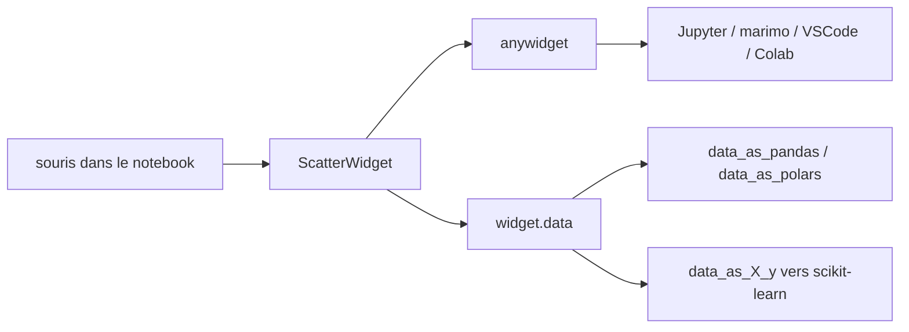

# koaning/drawdata

> **Un widget de notebook pour dessiner un jeu de données à la souris et le récupérer en DataFrame.**

## Le problème

Pour illustrer un algorithme de machine learning, il faut un jeu de données au comportement
choisi : deux lunes, un nuage bruité, une frontière tordue. Sans outil, on le génère par code
et on itère à l'aveugle au lieu de montrer directement la forme voulue.

## Ce que ça fait vraiment

Le paquet fournit des widgets à instancier dans un notebook, dont `ScatterWidget`, qui ouvre
une zone de dessin. On y trace des points à la souris, éventuellement en plusieurs couleurs.
Les points dessinés sont ensuite lisibles côté Python : `widget.data` renvoie une liste de
dictionnaires, `widget.data_as_pandas` et `widget.data_as_polars` renvoient un DataFrame, et
`widget.data_as_X_y` renvoie le couple `X, y` attendu par scikit-learn. Le README précise la
convention de cette dernière propriété : plusieurs couleurs dessinées valent classification,
une seule couleur vaut régression, et `y` désigne alors l'axe des ordonnées. Le dessin peut
être mis à jour et relu pendant la session ; le README pointe une vidéo où chaque
modification déclenche un nouvel entraînement scikit-learn.

## Comment c'est branché



Aucun diagramme tiré du code n'est disponible pour ce dépôt ; ce schéma est construit depuis
le README. La pièce centrale est `anywidget`, qui sert de couche d'affichage et explique la
compatibilité annoncée avec marimo, Jupyter, VSCode et Colab, ainsi que l'interopérabilité
avec `ipywidgets`.

## Essayer

```
uv pip install drawdata
```

```python
from drawdata import ScatterWidget

widget = ScatterWidget()
widget
```

```python
# Get the drawn data as a list of dictionaries
widget.data

# Get the drawn data as a dataframe
widget.data_as_pandas
widget.data_as_polars
```

```
X, y = widget.data_as_X_y
```

Le README signale aussi une page de démonstration en ligne, sans rien installer.

## Coût et pièges

Rien à payer, pas de clé d'API, pas de compte : le paquet s'installe par pip et tourne en
local. Le prérequis réel est un environnement de notebook compatible avec `anywidget` — le
README cite marimo, Jupyter, VSCode et Colab, sans indiquer de version minimale de Python ni
de liste de dépendances. `data_as_pandas` et `data_as_polars` supposent d'avoir pandas ou
polars installés de son côté, ce que le README n'explicite pas. La convention
classification/régression de `data_as_X_y` est implicite : dessiner une seule couleur change
silencieusement le sens de `y`.

## Ce que ce n'est pas

Ce n'est pas un générateur de données synthétiques réalistes ni un outil d'augmentation : les
points viennent de la main, pas d'une distribution paramétrée, et rien ne garantit la
reproductibilité d'un dessin à l'autre. Ce n'est pas non plus un outil d'annotation de
données existantes ni un éditeur de dataset : on dessine des points en deux dimensions, on ne
charge pas un fichier pour le corriger. Le README le présente lui-même comme une petite
bibliothèque, utile surtout en enseignement et en démonstration.

## Alternatives

Aucune alternative comparable dans le catalogue : les voisins proposés, ruc-datalab/DeepAnalyze
et StructuredLabs/preswald, relèvent de l'analyse et des applications de données, pas du
dessin interactif d'un jeu de points. Le seul projet voisin cité par le README est
`anywidget`, qui est la brique sous-jacente et non un concurrent.

## Pour toi

Utile si tu enseignes ou démontres des modèles : produire en dix secondes une frontière
tordue et la passer à scikit-learn vaut mieux qu'un `make_moons` qu'on ajuste à tâtons. Pour
du travail sur données réelles, l'outil n'a pas d'usage.
