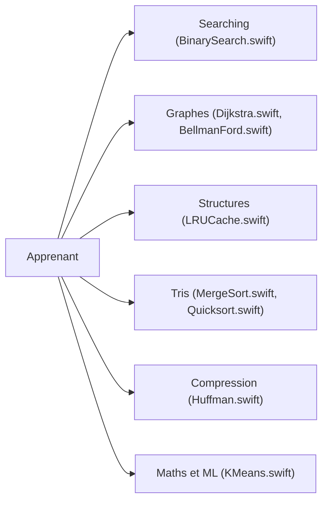

# kodecocodes/swift-algorithm-club

> Collection pédagogique d'algorithmes et de structures de données en Swift, expliqués pas à pas.

## Le problème
Apprendre les algorithmes et structures de données classiques en Swift demande des explications claires plutôt que des bibliothèques opaques.

## Ce que ça fait vraiment
Un dossier par sujet avec une explication et une implémentation Swift : recherche, chaînes, tris, compression (Huffman, RLE), mathématiques, structures (piles, files, arbres, tas, tables de hachage, graphes), quelques algorithmes d'apprentissage (k-means, régression linéaire, Naive Bayes) et des énigmes d'entretien. Le README annonce que le but est la clarté, pas une bibliothèque réutilisable.

## Comment c'est branché

## Essayer
Aucune commande documentée : ouvrir un dossier d'algorithme et son playground dans Xcode.

## Coût et pièges
Gratuit. Code déclaré compatible Xcode 10 et Swift 4.2, avec un dernier push le 2024-12-06 : à adapter aux versions récentes. Le README renvoie à un livre payant.

## Ce que ce n'est pas
Pas une bibliothèque à dépendre. Les sections d'apprentissage sont des exemples jouets, pas un outil ML.

## Alternatives
Aucune alternative citée dans le README.

## Pour toi
À ignorer : Swift, ancien et pédagogique, sans utilité directe pour un profil data/IA/MLOps ; seule valeur : réviser les bases algorithmiques.

