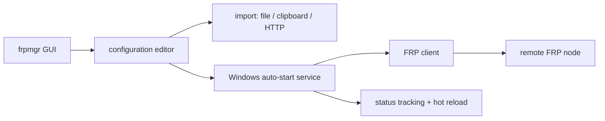

# koho/frpmgr

> **One sentence.** A Windows graphical front end for FRP: edit, launch and monitor reverse proxies without writing a configuration file.

## The problem

Exposing a local server behind a NAT or firewall with FRP means assembling the client, a
configuration file and a launcher by hand. The README names that exact situation: several tools
to combine into a stable service, and the same tedious steps repeated at every deployment.

## What it actually does

FRP Manager is a multi-node graphical reverse proxy tool for [FRP](https://github.com/fatedier/frp)
on Windows. It bundles an editor, a launcher, status tracking and hot reload. Launched
configurations run independently as background services, so the GUI can be closed once the
settings are done. A launched configuration is registered by default as an auto-start service and
comes up at system boot without requiring a login. Hot reload applies proxy changes to a running
configuration without restarting the service and without losing proxy state. Configurations can be
imported from a local file, the clipboard or HTTP, and exported. The README also describes a
self-destructing configuration, which disappears and becomes unreachable after a set amount of
time, and status tracking shown in a table view rather than read from logs.

## How it is wired

No code-derived diagram exists for this repository; the graph below is reconstructed from the
README.



The entry point is `./cmd/frpmgr`, the only source path named in the README; the rest of the tree
is not documented there.

## Trying it

The README documents building from source only — installing a released binary is deferred to the
wiki. Declared dependencies: Go, Node v22, Windows SDK, MinGW, WiX Toolset v3.14, with
`WindowsSdkVerBinPath` set.

```shell
git clone https://github.com/koho/frpmgr
cd frpmgr
build.bat
```

```shell
build.bat -p
```

```shell
go generate
go run ./cmd/frpmgr
```

`build.bat -p` skips the installer and yields a portable application, requiring only Go and MinGW;
installation files land in the `bin` directory.

## Cost and gotchas

Free, Apache-2.0, no API key and no account to create. The real cost is the platform: the latest
release requires at least Windows 10 or Server 2016. The full build chain is heavy (Windows SDK,
MinGW, WiX, Node v22); the `-p` option trims it. Usage documentation lives in the wiki, not in the
repository. The README declares one integrated outbound service, `api.github.com` for update
checks, which can be enabled or disabled in the settings; the privacy policy states no other
information is transferred. Code signing is provided free of charge by the SignPath Foundation.

## What it is not

It is not a reverse proxy implementation: the tunnel is still FRP's, frpmgr is the GUI and service
manager around it. It is not cross-platform — nothing in the README covers Linux or macOS, and the
service model relies on Windows mechanisms. It is not a server: it configures the client and
visitor side, the remote node is still yours to provide. It is not a command-line or automatable
component either; the documented entry point is the graphical application.

## Alternatives

- **fatedier/frp**: the upstream project. Pick it whenever you are off Windows, on a server, or
  want configuration driven by files and automated deployment.
- **caddyserver/caddy**: pick it to serve HTTP(S) with automatic certificates when the need is a
  web reverse proxy rather than a tunnel through a NAT.
- **txthinking/brook**: another network tunneling tool, command-line oriented and cross-platform,
  if a Windows GUI is not the deciding factor.

## Why it matters to you

Limited relevance for a data / AI / MLOps role on Linux: nothing here touches models, data or
pipelines. The genuine niche is exposing a demo, a notebook or an API running on a Windows machine
behind a NAT without hand-rolling a tunnel. Worth remembering for that case, not worth adopting by
default.
