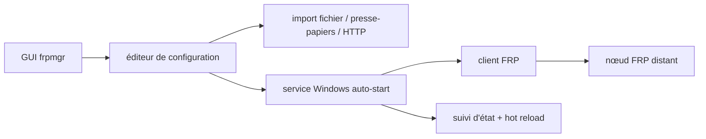

# koho/frpmgr

> **Une phrase.** Interface graphique Windows pour piloter FRP : éditer, lancer et surveiller des proxys inverses sans écrire de fichier de configuration.

## Le problème

Exposer un serveur local derrière un NAT ou un pare-feu avec FRP suppose d'assembler à la main
le client, un fichier de configuration et un lanceur. Le README décrit précisément ce cas
d'usage : plusieurs outils à combiner pour obtenir un service stable, et des opérations
répétitives à chaque déploiement.

## Ce que ça fait vraiment

FRP Manager est un outil graphique multi-nœuds pour [FRP](https://github.com/fatedier/frp) sur
Windows. Il fournit un éditeur de configuration, un lanceur, le suivi d'état et le rechargement
à chaud. Les configurations lancées tournent comme services d'arrière-plan indépendants : la
fenêtre peut être fermée. Une configuration lancée est enregistrée par défaut comme service à
démarrage automatique, actif au boot sans ouverture de session. Le rechargement à chaud applique
une modification de proxy sans redémarrer le service ni perdre l'état des proxys. Les
configurations s'importent depuis un fichier local, le presse-papiers ou HTTP, et s'exportent.
Le README mentionne aussi une configuration « auto-destructrice », qui disparaît et devient
inatteignable après un certain délai, et un suivi de l'état des proxys dans une vue tableau
plutôt que dans les journaux.

## Comment c'est branché

Aucun diagramme tiré du code n'est disponible pour ce dépôt ; ce schéma est reconstruit depuis
le README.



Le code d'entrée est `./cmd/frpmgr`, seul chemin de fichier nommé dans le README ; le reste de
l'arborescence n'y est pas documenté.

## Essayer

Le README ne documente que la compilation depuis les sources — l'installation d'un binaire
renvoie au wiki. Dépendances annoncées : Go, Node v22, Windows SDK, MinGW, WiX Toolset v3.14,
avec `WindowsSdkVerBinPath` positionné.

```shell
git clone https://github.com/koho/frpmgr
cd frpmgr
build.bat
```

```shell
build.bat -p
```

```shell
go generate
go run ./cmd/frpmgr
```

`build.bat -p` produit une application portable et ne demande alors que Go et MinGW ; les
fichiers d'installation atterrissent dans `bin`.

## Coût et pièges

Gratuit, licence Apache-2.0, aucune clé d'API ni compte à créer. Le vrai coût est la plateforme :
la dernière version exige au minimum Windows 10 ou Server 2016. La chaîne de compilation complète
est lourde (Windows SDK, MinGW, WiX, Node v22) ; l'option `-p` la réduit. La documentation
d'usage vit dans le wiki, pas dans le dépôt. Le README signale une seule connexion sortante
intégrée, vers `api.github.com` pour la vérification de mises à jour, activable ou désactivable
dans les réglages ; la politique de confidentialité annonce qu'aucune autre information n'est
transmise. La signature de code est fournie gratuitement par la SignPath Foundation.

## Ce que ce n'est pas

Ce n'est pas une implémentation de proxy inverse : le tunnel reste celui de FRP, frpmgr en est
l'enveloppe graphique et le gestionnaire de services. Ce n'est pas multiplateforme — rien dans
le README ne concerne Linux ou macOS, et les services reposent sur des mécanismes Windows. Ce
n'est pas un serveur : on y configure le côté client et les visiteurs, le nœud distant reste à
fournir. Ce n'est pas non plus un outil en ligne de commande ni une brique automatisable : le
point d'entrée documenté est l'interface graphique.

## Alternatives

- **fatedier/frp** : le projet amont. À préférer dès qu'on est hors Windows, en serveur, ou
  qu'on veut piloter la configuration par fichier et déploiement automatisé.
- **caddyserver/caddy** : à choisir pour exposer du HTTP(S) avec certificats automatiques quand
  le besoin est un reverse proxy web, pas un tunnel à travers un NAT.
- **txthinking/brook** : autre outil de tunneling réseau, orienté ligne de commande et
  multiplateforme, si l'interface graphique Windows n'est pas le critère.

## Pour toi

Intérêt limité pour un poste data / IA / MLOps sous Linux : rien ici ne touche aux modèles, aux
données ni aux pipelines. La niche réelle est d'exposer une démo, un notebook ou une API tournant
sur un poste Windows derrière un NAT, sans monter de tunnel à la main. À garder sous le coude
pour ce cas précis, pas à adopter par défaut.
