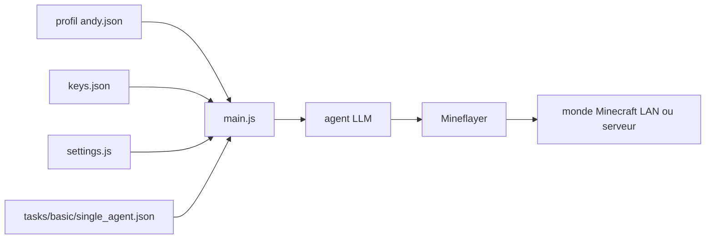

# kolbytn/mindcraft

> **Sandbox for LLM agents embodied in Minecraft, aimed at multi-agent reasoning research.**

## The problem

Testing an LLM as an embodied agent needs a persistent world, a body, actions and a repeatable
evaluation. Without that you stay on text benchmarks and never see whether the model can plan,
gather resources and cooperate over time. Wiring an LLM to a Minecraft client through
Mineflayer yourself is integration work you would redo for every API provider.

## What it actually does

Connects one or several Minecraft bots, driven by LLMs through Mineflayer, to an open world on
LAN or an online server. Each bot is described by a JSON profile such as `andy.json` setting
its name, prompts, examples and up to five distinct models: `model` for chat, `code_model` for
action generation, `vision_model` for images, `embedding` for example selection and
`speak_model` for voice synthesis. The README lists eighteen supported APIs, including
`ollama` and `vllm` locally. A task mode starts the bot with a measurable goal — collect four
`oak_log`, build a blueprint — described in a task JSON with initial inventory, `timeout`,
`blocked_actions` and agent count. LLM code writing and execution (`allow_insecure_coding`) is
off by default; the README warns the sandbox is still open to injection attacks.

## How it is wired



`main.js` is the entry point: it reads `settings.js` for host, port and the profile list,
`keys.json` for API keys, and one JSON profile per agent. Each agent talks to its chosen model
provider and then acts in the world through Mineflayer. Files under `tasks/` supply the goal,
the starting inventory and the stop conditions.

## Trying it

```bash
npm install
node main.js
node main.js --task_path tasks/basic/single_agent.json --task_id gather_oak_logs
node main.js --profiles ./profiles/andy.json ./profiles/jill.json
ollama pull sweaterdog/andy-4:micro-q8_0 && ollama pull embeddinggemma
docker build -t mindcraft . && docker run --rm --add-host=host.docker.internal:host-gateway -p 8080:8080 -p 3000-3003:3000-3003 -e SETTINGS_JSON='{"auto_open_ui":false,"profiles":["./profiles/gemini.json"],"host":"host.docker.internal"}' --volume ./keys.json:/app/keys.json --name mindcraft mindcraft
docker-compose up --build
```

Beforehand: rename `keys.example.json` to `keys.json` and open a world to LAN on port `55916`.

## Cost and traps

You need a copy of Minecraft Java Edition (up to v1.21.11, v1.21.6 recommended), so a purchase,
plus a second Microsoft account if you want to play alongside the bot on an online server.
Node 18 or 20 LTS: the README notes Node 24+ breaks native dependencies and that `npm install`
can fail on macOS. At least one API key at your own expense, OpenAI by default; the bill scales
with agent count and episode length, which the README does not document. A no-bill path exists
through `ollama`/`vllm`, but embeddings are supported by only five APIs and otherwise fall back
to plain word overlap with reduced performance. Main trap: `allow_insecure_coding` lets the LLM
write and run code on your machine; the README recommends the Docker container and explicitly
warns against public servers.

## What it is not

Not a Minecraft mod and not an in-game AI: the bot is an external client joining as a player.
Not a general autonomous agent — its abilities are those of Mineflayer inside a block world.
Not a supported product: the maintainers state they are not very responsive to GitHub issues
and point to Discord and pull requests instead. The bot name in the profile must match the
Minecraft profile name exactly, otherwise it spams talk to itself.

## Alternatives

The README names no competing project and no catalogue neighbours were supplied, so there is no
comparable alternative to list here. The only named building blocks are dependencies rather
than substitutes: Mineflayer for driving the Minecraft client, and ollama for running models
locally instead of through a paid API.

## For you

Worth knowing as a testbed for embodied LLM agents: the repo backs an arXiv paper (2504.17950)
and ships measurable, multi-agent tasks, which makes it a reproducible evaluation harness
rather than a demo. Watch it if you work on agent evaluation or multi-agent cooperation; skip
it if you want an agent framework to run in production — the licence is not even declared.
