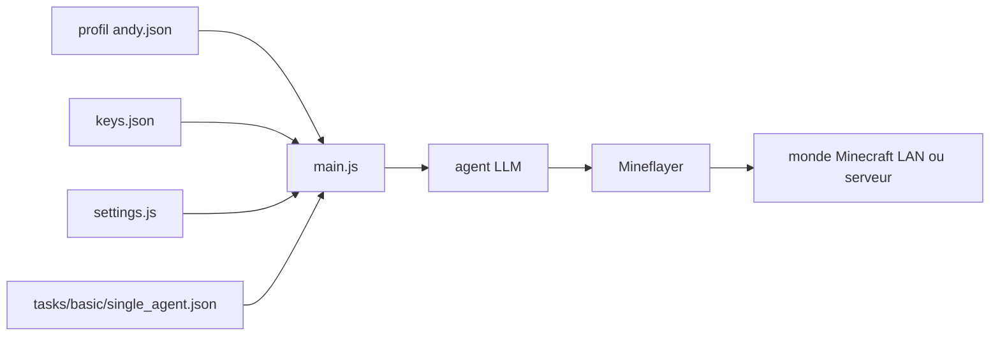

# kolbytn/mindcraft

> **Bac à sable d'agents LLM incarnés dans Minecraft, pour chercheurs en raisonnement multi-agents.**

## Le problème

Tester un LLM comme agent incarné demande un monde persistant, un corps, des actions et une
évaluation reproductible. Sans cela, on reste sur des benchmarks textuels : on ne voit pas si
le modèle sait planifier, collecter des ressources et coopérer sur la durée. Brancher soi-même
un LLM sur un client Minecraft via Mineflayer représente un travail d'intégration à refaire
pour chaque fournisseur d'API.

## Ce que ça fait vraiment

Connecte un ou plusieurs bots Minecraft (via Mineflayer) pilotés par des LLM à un monde ouvert
en LAN ou à un serveur en ligne. Chaque bot est décrit par un profil JSON (`andy.json`) qui
fixe son nom, ses prompts, ses exemples, et jusqu'à cinq modèles distincts : `model` pour le
dialogue, `code_model` pour la génération d'actions, `vision_model` pour les images,
`embedding` pour la sélection d'exemples, `speak_model` pour la synthèse vocale. Le README
liste dix-huit API supportées, dont `ollama` et `vllm` en local. Un mode « tâches » lance le
bot avec un objectif chiffré — collecter quatre `oak_log`, construire un plan — décrit dans un
JSON de tâche avec inventaire initial, `timeout`, `blocked_actions` et nombre d'agents. La
génération et l'exécution de code par le LLM (`allow_insecure_coding`) sont désactivées par
défaut ; le README avertit explicitement que le bac à sable reste vulnérable aux injections.

## Comment c'est branché



`main.js` est le point d'entrée : il lit `settings.js` pour l'hôte, le port et la liste de
profils, `keys.json` pour les clés d'API, et un profil JSON par agent. Chaque agent dialogue
avec le fournisseur de modèle choisi puis agit dans le monde via Mineflayer. Les fichiers de
tâches sous `tasks/` fournissent objectif, inventaire de départ et conditions d'arrêt.

## Essayer

```bash
npm install
node main.js
node main.js --task_path tasks/basic/single_agent.json --task_id gather_oak_logs
node main.js --profiles ./profiles/andy.json ./profiles/jill.json
ollama pull sweaterdog/andy-4:micro-q8_0 && ollama pull embeddinggemma
docker build -t mindcraft . && docker run --rm --add-host=host.docker.internal:host-gateway -p 8080:8080 -p 3000-3003:3000-3003 -e SETTINGS_JSON='{"auto_open_ui":false,"profiles":["./profiles/gemini.json"],"host":"host.docker.internal"}' --volume ./keys.json:/app/keys.json --name mindcraft mindcraft
docker-compose up --build
```

Avant cela : renommer `keys.example.json` en `keys.json`, ouvrir un monde en LAN sur le port
`55916`.

## Coût et pièges

Il faut une copie de Minecraft Java Edition (jusqu'à v1.21.11, v1.21.6 recommandée) — donc un
achat et, pour jouer en même temps que le bot sur un serveur en ligne, un second compte
Microsoft. Node 18 ou 20 LTS : le README signale que Node 24+ casse les dépendances natives,
et que `npm install` peut échouer sur macOS. Au moins une clé d'API à ta charge, OpenAI par
défaut ; la facture dépend du nombre d'agents et de la durée des épisodes, non documentée. La
voie sans facture existe via `ollama`/`vllm`, mais l'embedding n'est supporté que par cinq API
et retombe sinon sur un simple recouvrement de mots, avec performances réduites. Piège
principal : `allow_insecure_coding` fait écrire et exécuter du code par le LLM sur ta machine ;
le README recommande le conteneur Docker et déconseille formellement les serveurs publics.

## Ce que ce n'est pas

Ce n'est pas un mod Minecraft ni une IA intégrée au jeu : le bot est un client externe qui se
connecte comme un joueur. Ce n'est pas un agent autonome généraliste — les capacités sont
celles de Mineflayer, dans un monde de blocs. Ce n'est pas un produit fini avec support : les
mainteneurs écrivent qu'ils sont peu réactifs aux issues GitHub et renvoient vers Discord et
les pull requests. Le nom du bot dans le profil doit correspondre exactement au profil
Minecraft, sinon il se parle à lui-même.

## Alternatives

Le README ne nomme aucun projet concurrent, et aucun voisin de catalogue n'a été fourni : il
n'y a donc aucune alternative comparable à citer ici. Les seules briques nommées sont des
dépendances, pas des substituts — Mineflayer pour le contrôle du client Minecraft, et ollama
pour faire tourner les modèles en local plutôt que via une API payante.

## Pour toi

Intéressant comme banc d'essai d'agents LLM incarnés : le dépôt est adossé à un papier arXiv
(2504.17950) et propose des tâches chiffrées et multi-agents, ce qui en fait un support
d'évaluation reproductible plutôt qu'une démo. À surveiller si tu travailles sur l'évaluation
d'agents ou la coopération multi-agents ; à laisser de côté si tu cherches un framework
d'agents à mettre en production — la licence n'est même pas déclarée.
