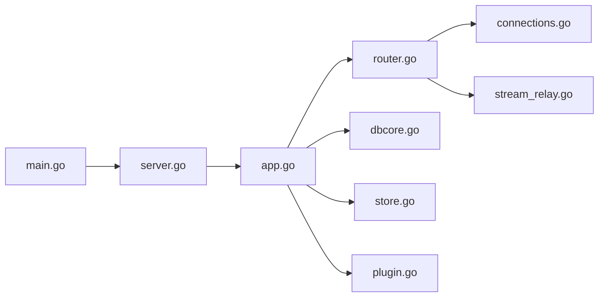

# komari-monitor/komari

> Supervision de serveurs auto-hébergée, avec agents légers, tableau de bord web et terminal distant.

## Le problème
Suivre l'état de plusieurs serveurs sans SaaS de monitoring demande d'assembler soi-même collecte, stockage et interface.

## Ce que ça fait vraiment
Un binaire Go (Gin, WebSocket, JSON-RPC) reçoit les métriques d'agents à la seconde et les historise en SQLite (PostgreSQL pris en charge par le moteur de métriques).
Interface web embarquée : tableau de bord, historiques, terminal web, transfert de fichiers via l'agent.
Plugins exécutés dans un runtime JavaScript, thèmes, notifications (e-mail, Telegram, webhooks…), OAuth.

## Comment c'est branché

## Essayer
Aucune commande dans le README : il renvoie au guide d'installation (Docker, binaire, source).

## Coût et pièges
Gratuit ; le README met en avant des hébergeurs partenaires payants. Outil de contrôle à distance : exposition à sécuriser soi-même.

## Ce que ce n'est pas
Pas un simple afficheur de métriques : il exécute des commandes et transfère des fichiers sur les machines. Le dépôt est archivé.

## Alternatives
Aucune alternative nommée dans le README.

## Pour toi
À ignorer : dépôt archivé et README d'une page, alors qu'un outil qui ouvre un terminal sur tes serveurs exige une maintenance active.
