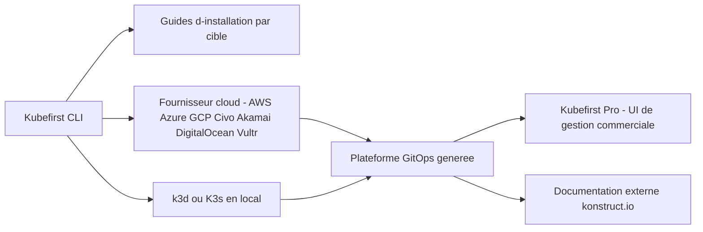

# konstructio/kubefirst

> **A CLI that stands up a full GitOps Kubernetes platform on a cloud provider, for platform teams.**

## The problem

Without it, assembling a Kubernetes cluster, its GitOps tooling, its git repositories and its
cloud native integrations is done by hand, one tool at a time, and redone for every new
environment. The README does not spell out that cost; it only promises "in minutes".

## What it actually does

The README stays very short: Kubefirst is a CLI that creates "instant GitOps platforms"
integrating cloud native tools from scratch. It targets several install destinations, each with
its own external guide: Akamai, AWS, Azure, Civo, DigitalOcean, Google Cloud, Vultr, K3s and
k3d locally. It also installs, by default, the commercial Kubefirst Pro management UI on the
OSS platform it creates. Which tools exactly get assembled is not documented in the README: it
points to an external documentation site and an architecture image. This repository is the CLI,
not the platform itself.

## How it is wired



The README names no file in the repository and no internal component: the diagram above only
reflects what it exposes, namely a CLI, a choice of install target, the resulting platform and
the Pro UI layered on top. The real architecture is deferred to an image
(`images/kubefirst-oss-arch.svg`) and to the documentation site, neither read here.

## Trying it

```bash
# no command is documented in the README
```

The README gives no command: for each target it links to an install guide hosted on
`kubefirst-pro.konstruct.io`. Nothing has been reconstructed here.

## Cost and traps

You need an account with a cloud provider (or k3d/K3s locally) and, per the README,
target-specific prerequisites that are listed only in the external guides. The main trap is
stated outright: the **Kubefirst Pro management UI is commercial** and "will be installed by
default" on the new platform. The CLI code is MIT, but the default experience pushes toward a
paid product whose pricing and terms the README does not mention. Second trap: all the useful
documentation lives outside the repository, hence outside your version control.

## What it is not

It is not a managed Kubernetes platform: the CLI provisions into your own provider account and
the cloud bill stays yours. It is also not a tool you can understand from its README — there is
no command, no list of installed components, no description of how it works. And it is not a
purely open source experience in practice, since the management layer offered by default is a
commercial product.

## Alternatives

None of the supplied neighbours is truly comparable: `gravitational/teleport` secures access to
clusters and servers but does not create them, `cilium/cilium` is an in-cluster networking and
observability layer, `kubearmor/KubeArmor` handles runtime security policy, and `anchore/grype`
scans images for vulnerabilities. None of them provisions a complete GitOps platform. The README
itself names no competitor.

## For you

Indirect interest for a data/MLOps profile: it is a way to get a Kubernetes GitOps foundation
quickly, on which ML workloads can then sit, but the opacity of the README and the commercial
UI installed by default call for reading the external documentation before committing. Watch it
rather than adopt it as is.
