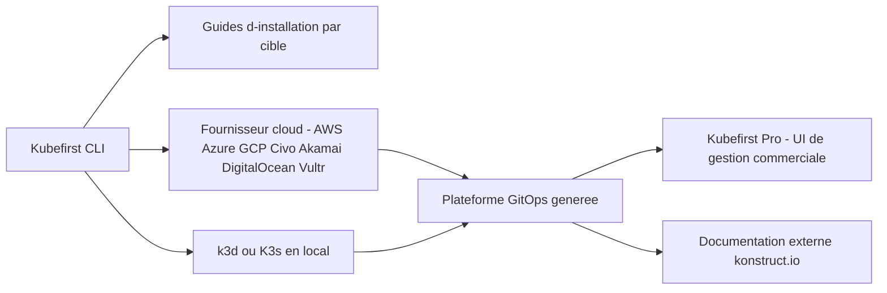

# konstructio/kubefirst

> **CLI qui monte une plateforme GitOps Kubernetes complète chez un fournisseur cloud, pour équipes plateforme.**

## Le problème

Sans lui, assembler un cluster Kubernetes, son outillage GitOps, ses dépôts git et ses
intégrations cloud native se fait à la main, outil par outil, et se refait à chaque nouvel
environnement. Le README ne détaille pas ce coût, il se contente de promettre « en minutes ».

## Ce que ça fait vraiment

Le README reste très court : Kubefirst est une CLI qui crée « des plateformes GitOps
instantanées » intégrant des outils cloud native, à partir de zéro. Elle vise plusieurs cibles
d'installation, chacune avec son guide externe : Akamai, AWS, Azure, Civo, DigitalOcean,
Google Cloud, Vultr, K3s et k3d en local. Elle installe aussi par défaut, sur la plateforme
OSS créée, l'interface de gestion commerciale Kubefirst Pro. Quels outils exactement sont
assemblés n'est pas documenté dans le README : il renvoie à un site de documentation externe
et à une image d'architecture. Le dépôt est le CLI, pas la plateforme elle-même.

## Comment c'est branché



Le README ne nomme aucun fichier du dépôt ni aucun composant interne : le schéma ci-dessus ne
reprend que ce qu'il expose, à savoir une CLI, un choix de cible d'installation, la plateforme
qui en résulte et l'UI Pro posée dessus. L'architecture réelle est renvoyée à une image
(`images/kubefirst-oss-arch.svg`) et au site de documentation, non lus ici.

## Essayer

```bash
# aucune commande n'est documentée dans le README
```

Le README ne donne aucune commande : il renvoie, pour chaque cible, vers un guide
d'installation hébergé sur `kubefirst-pro.konstruct.io`. Rien n'a été reconstruit ici.

## Coût et pièges

Il faut un compte chez un fournisseur cloud (ou k3d/K3s en local) et, d'après le README, des
prérequis propres à chaque cible, listés uniquement dans les guides externes. Le piège
principal est explicite : l'UI de gestion **Kubefirst Pro est commerciale** et « sera installée
par défaut » sur la plateforme créée. Le code du CLI est MIT, mais l'expérience par défaut
pousse vers un produit payant dont le README ne donne ni tarif ni conditions. Second piège :
toute la documentation utile vit hors du dépôt, donc hors de ton contrôle de version.

## Ce que ce n'est pas

Ce n'est pas une plateforme Kubernetes managée : la CLI provisionne chez ton fournisseur, la
facture cloud reste la tienne. Ce n'est pas non plus un outil qu'on lit dans son README — il
n'y a ni commande, ni liste des composants installés, ni description du fonctionnement. Et ce
n'est pas un projet purement open source dans son usage courant, puisque la couche de gestion
proposée par défaut est un produit commercial.

## Alternatives

Aucune alternative vraiment comparable parmi les voisins fournis : `gravitational/teleport`
sécurise l'accès aux clusters et serveurs mais ne les crée pas, `cilium/cilium` est une couche
réseau et observabilité intra-cluster, `kubearmor/KubeArmor` fait de la politique de sécurité à
l'exécution, et `anchore/grype` scanne des vulnérabilités d'images. Aucun ne provisionne une
plateforme GitOps complète. Le README lui-même ne cite aucun concurrent.

## Pour toi

Intérêt indirect pour un profil data/MLOps : c'est un moyen d'obtenir rapidement un socle
Kubernetes GitOps sur lequel poser des charges ML, mais l'opacité du README et l'UI commerciale
installée par défaut invitent à regarder la documentation externe avant de s'engager. À
surveiller plutôt qu'à adopter tel quel.
