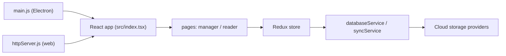

# koodo-reader/koodo-reader

> Lecteur de livres numériques multiplateforme, avec synchronisation cloud, notes et outils IA optionnels.

## Le problème
Lire EPUB, PDF, MOBI ou bandes dessinées sur plusieurs appareils avec notes et progression synchronisées demande souvent plusieurs applications ou un compte propriétaire.

## Ce que ça fait vraiment
Application React/TypeScript empaquetée en Electron (Windows, macOS, Linux), web, Android, iOS et Docker. Les livres et notes sont stockés localement, puis synchronisables vers OneDrive, Google Drive, Dropbox, WebDAV, S3 et d'autres. OCR (Tesseract/Paddle) et lecture des archives tournent côté client. L'IA (traduction, dictionnaire, résumé) utilise ton propre modèle ; le README promet aucun suivi.

## Comment c'est branché


## Essayer
```bash
winget install AppByTroye.KoodoReader
flatpak install flathub io.github.troyeguo.koodo-reader
brew install --cask koodo-reader
git clone https://github.com/koodo-reader/koodo-reader.git && cd koodo-reader && yarn && yarn dev
```

## Coût et pièges
Gratuit. Les services de synchronisation tiers ont leurs propres comptes et quotas. 271 issues ouvertes. Licence AGPL-3.0 : obligations si tu fournis une version modifiée en service.

## Ce que ce n'est pas
Ce n'est pas une bibliothèque de lecture intégrable ; c'est une application. L'IA n'est pas fournie : il faut brancher son propre modèle.

## Alternatives
- Aucune alternative nommée dans le README (KOReader n'est cité que comme cible de synchronisation).

## Pour toi
Surveiller : pratique pour lire des papiers PDF et exporter surlignages vers Obsidian ou Notion, sans rapport avec le développement.

