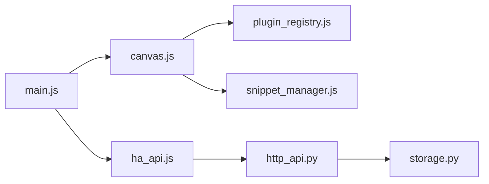

# koosoli/ESPHomeDesigner

> Éditeur visuel glisser-déposer pour afficheurs connectés ESPHome, OpenEpaperLink et OpenDisplay, intégré à Home Assistant.

## Le problème
Écrire à la main le code lambda ou LVGL d'un écran ESP32 ou e-paper est long et difficile à prévisualiser.

## Ce que ça fait vraiment
Canevas multi-pages avec plus de 55 widgets (texte, graphes, météo, QR, zones tactiles) liés à des entités Home Assistant ou des topics MQTT. Génère du YAML ESPHome (C++ ou LVGL), du JSON OpenEpaperLink ou OpenDisplay, et réimporte du YAML pour l'édition aller-retour. Assistant IA (Gemini, OpenAI, OpenRouter) pour générer des mises en page. Mode LVGL signalé comme instable.

## Comment c'est branché


## Essayer
```bash
npm install
npm run dev
npm test
npm run python:test
npm run quality
```

## Coût et pièges
Gratuit ; l'assistant IA utilise ta clé du fournisseur. Il faut un Home Assistant, un jeton longue durée et une configuration CORS. LVGL exige un ESP32-S3 avec PSRAM. Le YAML généré est à coller à la main dans ta config ESPHome.

## Ce que ce n'est pas
Pas un flasheur ni un remplaçant d'ESPHome : il produit un extrait de YAML. Le code `lambda:` très personnalisé peut ne pas se reconstruire correctement à l'import.

## Alternatives
Aucune alternative nommée dans le README.

## Pour toi
À ignorer : domotique et écrans embarqués, loin du périmètre data/IA/MLOps ; GPL-3.0 et mainteneur unique.

