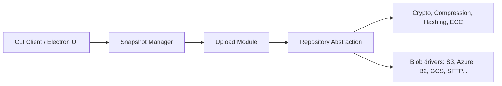

# kopia/kopia

> Outil de sauvegarde chiffrée avec déduplication, en CLI et GUI, vers le stockage de ton choix.

## Le problème
Sauvegarder des dossiers importants vers un cloud ou un NAS sans confier ses données en clair ni payer pour des doublons.

## Ce que ça fait vraiment
Crée des instantanés chiffrés, compressés et dédupliqués de fichiers et dossiers (pas d'image disque). Le moteur Go est piloté par une CLI, une UI Electron ou un serveur de dépôt gRPC/HTTP. Stockage : S3 et compatibles, Azure, B2, GCS, WebDAV, SFTP, Rclone (expérimental), disque local. Notifications par e-mail, webhook, Pushover.

## Comment c'est branché

## Essayer
Le README ne donne pas de commande : il renvoie à la page d'installation et au « Getting Started Guide » du site.

## Coût et pièges
Logiciel gratuit ; le stockage cloud choisi reste à ta charge. Rclone est expérimental. 883 issues ouvertes.

## Ce que ce n'est pas
Pas une sauvegarde de machine entière : il ne fait pas d'image système.

## Alternatives
Aucune alternative citée dans le README.

## Pour toi
À adopter : sauvegarde chiffrée et dédupliquée de jeux de données ou d'expériences vers S3/B2, sous Apache-2.0 et activement poussé.

