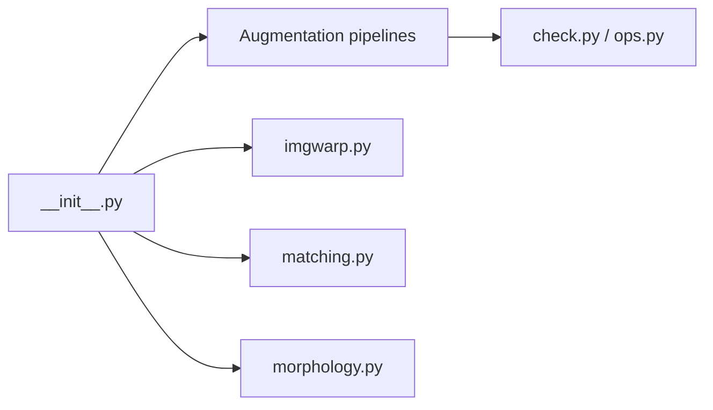

# kornia/kornia

> Bibliothèque PyTorch de vision par ordinateur différentiable : filtres, géométrie, augmentations, modèles.

## Le problème
Les opérateurs de vision classiques (OpenCV) ne s'intègrent pas dans le graphe de gradient ni sur GPU en lot.

## Ce que ça fait vraiment
Plus de 500 opérateurs différentiables : filtres, transformations, couleur, morphologie, augmentations (`AugmentationSequential`, AutoAugment), détection et mise en correspondance de points (LoFTR, LightGlue, DISK), géométrie de caméra et pertes. Export ONNX via `ONNXSequential`. Le zoo de modèles est gelé pour l'extension ; la direction annoncée est celle d'une implémentation de référence de la géométrie.

## Comment c'est branché


## Essayer
```bash
pip install kornia
pip install git+https://github.com/kornia/kornia
pixi install
pixi run test
```

## Coût et pièges
Gratuit. Certaines fonctions (ONNX, Stable Diffusion dissolving) demandent des extras. GPU utile, non obligatoire.

## Ce que ce n'est pas
Pas un framework d'entraînement : une boîte à outils tensorielle. Aucun nouveau modèle ne sera intégré sans parrain mainteneur.

## Alternatives
Aucune alternative nommée dans le README.

## Pour toi
À adopter si tu fais de la vision sous PyTorch : augmentations et géométrie sur GPU, Apache-2.0, activité récente.

