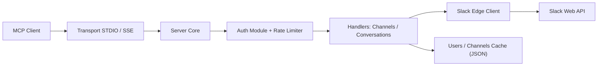

# korotovsky/slack-mcp-server

> Serveur MCP en Go qui donne à un agent l'accès aux messages, canaux et groupes Slack.

## Le problème
Un agent ne peut ni lire l'historique Slack ni chercher dans les fils sans intégration dédiée.

## Ce que ça fait vraiment
Traduit les appels MCP en appels à l'API Slack (édge client). Outils : historique, réponses de fil, recherche de messages, liste de canaux, non-lus, groupes d'utilisateurs, « saved » ; écriture (message, réactions, marquage lu) désactivée par défaut. Authentification par jeton navigateur `xoxc/xoxd`, OAuth `xoxp` ou bot `xoxb` (fonctions réduites). Caches JSON locaux d'utilisateurs et de canaux ; transports stdio et SSE.

## Comment c'est branché


## Essayer
Le README fourni est tronqué : l'introduction et les sections d'installation sont absentes. Seules commandes présentes :
```bash
npx @modelcontextprotocol/inspector go run mcp/mcp-server.go --transport stdio
tail -n 20 -f ~/Library/Logs/Claude/mcp*.log
```

## Coût et pièges
Gratuit, mais il faut des jetons Slack sensibles (le README dit de ne jamais les partager). Les jetons de session navigateur contournent l'application officielle ; l'historique gratuit est limité à 90 jours.

## Ce que ce n'est pas
Pas un bot Slack officiel : sans cache, `channels_list` ne fonctionne pas ; les jetons bot n'ont pas la recherche.

## Alternatives
Aucune alternative nommée dans le README.

## Pour toi
À surveiller : pratique pour donner du contexte Slack à un agent, mais gérer des jetons de session personnels exige une vraie prudence.
