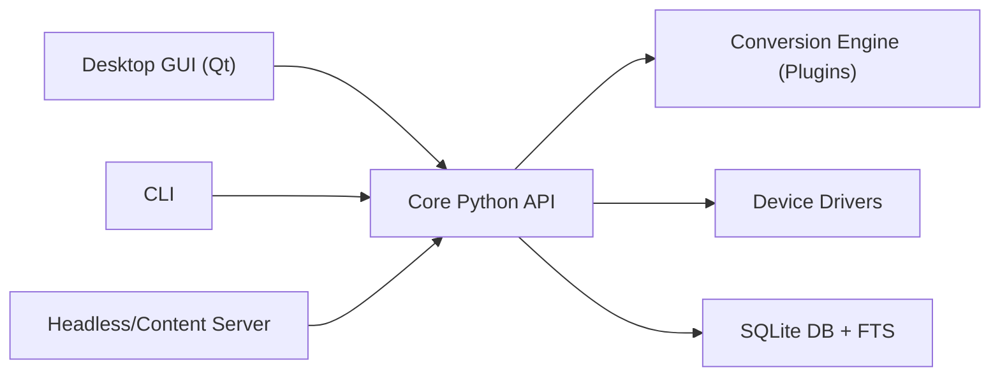

# kovidgoyal/calibre

> Gestionnaire de livres numériques qui lit, convertit, édite et catalogue tous les formats majeurs.

## Le problème
Les livres numériques existent en formats incompatibles, sur des appareils différents, sans catalogue unifié ni outil de conversion.

## Ce que ça fait vraiment
Application Python/Qt de bureau (Linux, Windows, macOS) qui gère une bibliothèque en SQLite avec recherche plein texte, convertit entre formats par plugins, dialogue avec des liseuses, récupère les métadonnées sur Internet et télécharge des journaux transformés en livres. Un serveur de contenu expose la bibliothèque à un front JavaScript. Le README dirige les bogues vers Launchpad, GitHub ne servant qu'à l'hébergement du code.

## Comment c'est branché

## Essayer
Aucune commande dans le README : il renvoie au manuel utilisateur, aux instructions de construction et à une archive de la version courante.

## Coût et pièges
Gratuit. Rapports de bogues sur Launchpad et non sur GitHub. GPL-3.0. Mainteneur principal unique d'après le nom du propriétaire.

## Ce que ce n'est pas
Ce n'est pas un simple lecteur : c'est un gestionnaire complet, lourd à installer depuis les sources. Le README est très court et renvoie tout à des pages externes.

## Alternatives
- Aucune alternative nommée dans le README.

## Pour toi
Surveiller : utile pour convertir des livres et des PDF en corpus texte, sans lien direct avec les pipelines data.

