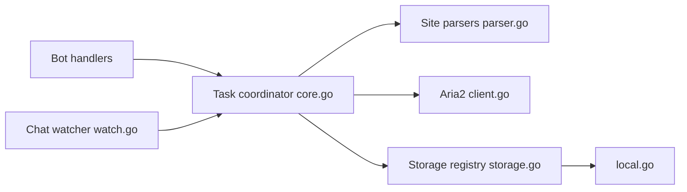

# krau/SaveAny-Bot

> Bot Telegram qui enregistre fichiers et médias vers un stockage choisi : disque, S3, WebDAV, Alist…

## Le problème
Sauvegarder à la main des fichiers Telegram, y compris protégés, vers un stockage personnel est fastidieux.

## Ce que ça fait vraiment
Un bot reçoit messages ou liens, les transforme en tâches (téléchargement, parseurs de sites en JavaScript, yt-dlp, Aria2) puis envoie vers un backend : Alist, S3, WebDAV, disque local, Rclone ou re-téléversement Telegram. Surveillance de conversations avec filtres, règles de rangement, multi-utilisateurs, API HTTP.

## Comment c'est branché


## Essayer
```bash
docker run -d --name saveany-bot \
    -v ./config.toml:/app/config.toml \
    -v ./downloads:/app/downloads \
    ghcr.io/krau/saveany-bot:latest
```

## Coût et pièges
Gratuit, mais il faut un jeton de bot via @BotFather et un fichier `config.toml`. Le contournement du « contenu restreint » peut violer les conditions de Telegram.

## Ce que ce n'est pas
Pas un client Telegram complet. Le README renvoie à une documentation externe pour la configuration détaillée.

## Alternatives
Aucune alternative nommée dans le README.

## Pour toi
À surveiller : utile pour archiver des pièces jointes vers un S3, mais l'AGPL et le contournement de restrictions en limitent l'usage pro.

