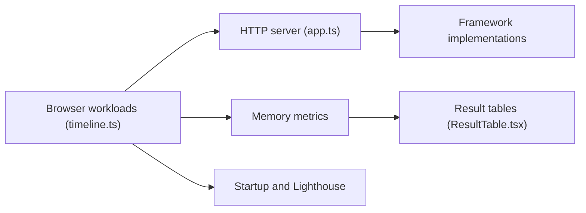

# krausest/js-framework-benchmark

> Banc d'essai de performance de frameworks JavaScript, mesurant tableaux, mémoire et démarrage.

## Le problème
Comparer objectivement le coût de rendu de frameworks front-end sur les mêmes opérations.

## Ce que ça fait vraiment
186 implémentations (keyed et non-keyed) servies par un serveur local ; un pilote WebDriver lance Chrome et mesure création, remplacement, mise à jour, sélection, échange, suppression, mémoire, démarrage et métriques Lighthouse. Génère un tableau de résultats. Un lancement complet prend environ 12 h selon le README.

## Comment c'est branché


## Essayer
```bash
git clone https://github.com/krausest/js-framework-benchmark.git
cd js-framework-benchmark
npm ci && npm run install-local
npm start
npm run bench
npm run results
```

## Coût et pièges
Gratuit. Installer les 186 paquets exécute du code tiers : l'auteur déconseille de le faire sur son poste (binaires précompilés fournis). Garder la fenêtre Chrome visible.

## Ce que ce n'est pas
Pas un classement fiable des frameworks pour ton cas : seulement un tableau de lignes.

## Alternatives
Aucune nommée dans le README.

## Pour toi
À ignorer : mesure du front-end web, sans lien avec data/IA/MLOps.

