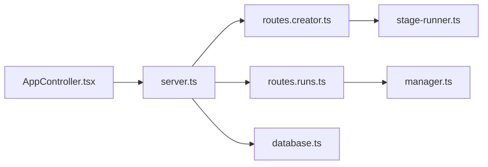

# krillinai/KlicStudio

> Atelier local de création (vidéo, image, texte) appelé OpenCreator, bâti sur la CLI Codex comme moteur d'agent.

## Le problème
Enchaîner traduction vidéo, génération d'images, scripts et voix demande plusieurs outils sans état partagé.

## Ce que ça fait vraiment
Espace web (React) et application de bureau (Electron) partageant un démon Fastify local. Dix outils : traduction vidéo, téléchargeur, miniatures, images, articles, posts Xiaohongshu, scripts, animation, doublage, génération vidéo. La conversation et les outils visuels partagent une même machine à états ; chaque révision crée une version. Le moteur d'agent, les Skills et MCP restent ceux de Codex. Le dépôt a changé de nom (ex-KrillinAI).

## Comment c'est branché


## Essayer
```bash
git clone https://github.com/krillinai/OpenCreator.git
cd OpenCreator
corepack enable
pnpm install
pnpm web:dev
```

## Coût et pièges
Node 22+, pnpm 9.15.0, CLI Codex connectée. Modèles et services (GPT Image, Seedance, TTS…) à ta charge. Écrit dans `$CODEX_HOME` : prudence sur les Skills globaux. Auto Clips et Digital Avatar « en développement ».

## Ce que ce n'est pas
Pas un moteur d'agent propre. Les exemples vidéo datent de l'époque KrillinAI.

## Alternatives
Aucune alternative nommée dans le README.

## Pour toi
À surveiller : intéressant pour du sous-titrage et doublage automatisé, mais dépend de Codex et de services payants, et le projet est en pleine refonte.

