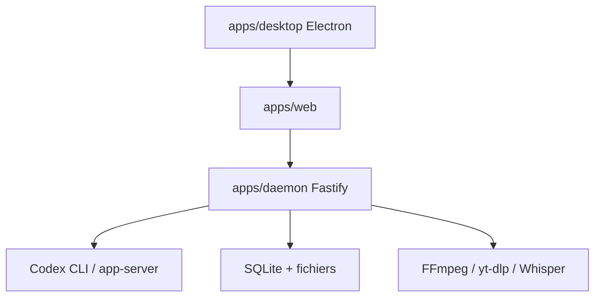

# krillinai/KrillinAI

> OpenCreator (ex-KrillinAI) : espace de travail local pour créateurs, avec traduction vidéo et agent Codex.

## Le problème
Produire sous-titres, doublages, images, scripts et animations demande d'enchaîner beaucoup d'outils séparés.

## Ce que ça fait vraiment
Interface web ou Electron, avec un runtime local Fastify qui pilote Codex CLI comme moteur d'agent. Dix outils de création (traduction vidéo, téléchargeur, miniatures, images, articles, scripts, dessin animé de bonhomme allumette), skills et MCP via Codex. Données locales en SQLite, ffmpeg, yt-dlp et Whisper pour les médias. Le diagramme fourni décrit encore l'ancien KrillinAI en Go.

## Comment c'est branché


## Essayer
```bash
git clone https://github.com/krillinai/OpenCreator.git
cd OpenCreator
corepack enable
pnpm install
pnpm web:dev
```

## Coût et pièges
Node 22, pnpm 9.15 et une connexion valide à Codex CLI. Clés des modèles, TTS et vidéo à ta charge. Le téléchargement de vidéos publiques peut poser des questions de droits.

## Ce que ce n'est pas
Pas l'outil Go décrit par le diagramme : le produit a été renommé et réécrit. Auto Clips et Digital Avatar sont encore en développement.

## Alternatives
- OpenAI Codex : moteur d'agent sur lequel s'appuie le produit.

## Pour toi
À surveiller : pertinent pour du contenu vidéo, moins pour la data/IA ; le fond du produit dépend de Codex CLI et de services payants.
