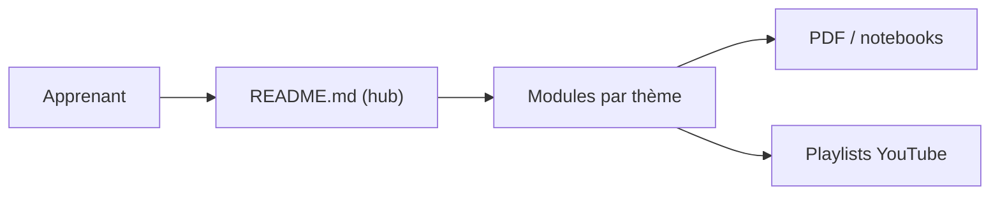

# krishnaik06/The-Grand-Complete-Data-Science-Materials

> Parcours de vidéos YouTube et de supports pour apprendre la data science, du Python au MLOps, par Krish Naik.

## Le problème
Un débutant ne sait pas dans quel ordre apprendre Python, statistiques, SQL, machine learning et déploiement.

## Ce que ça fait vraiment
README en 14 sections de listes de lecture YouTube (Python, stats, SQL, Git, EDA, ML, deep learning et NLP, Flask, BentoML, MLflow, SageMaker, Docker, IA générative, PySpark). D'après l'architecture décrite, les dossiers contiennent aussi des PDF et des notebooks. Plusieurs entrées sont marquées « bientôt » et le contenu est en anglais et en hindi.

## Comment c'est branché

## Essayer
Le README est une liste de liens : aucune commande.

## Coût et pièges
Gratuit, mais le contenu principal est sur YouTube et le README pointe vers un site de formation. Dernier push en août 2024, et plusieurs sections « à venir ».

## Ce que ce n'est pas
Pas un cours structuré avec exercices corrigés : c'est un index de vidéos. La licence GPL-2.0 s'applique au dépôt, pas aux vidéos.

## Alternatives
Aucune alternative nommée dans le README.

## Pour toi
À surveiller : utile comme plan d'apprentissage pour un junior, mais peu utile à un profil déjà confirmé ; contenu daté.

