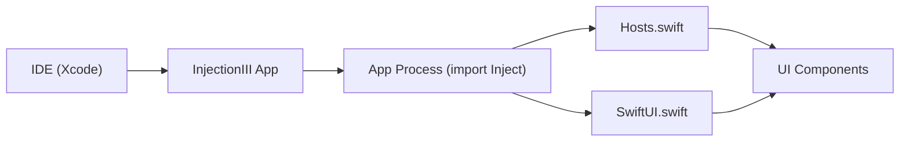

# krzysztofzablocki/Inject

> Paquet Swift qui simplifie le rechargement à chaud (hot reload) pour apps UIKit, AppKit et SwiftUI.

## Le problème
Chaque changement d'interface iOS/macOS oblige à recompiler, relancer et renaviguer jusqu'à l'écran voulu.

## Ce que ça fait vraiment
Fine surcouche autour d'InjectionIII, qui recompile et injecte le code dans l'app en cours. Pour SwiftUI, on ajoute `@ObserveInjection` et `.enableInjection()`. Pour UIKit/AppKit, on enveloppe la classe dans `ViewHost` ou `ViewControllerHost`. Le code ne fait rien en build non-debug.

## Comment c'est branché


## Essayer
```bash
# Package.swift : .package(url: "https://github.com/krzysztofzablocki/Inject.git", from: "1.2.4")
# ou Podfile : pod 'InjectHotReload'
```
Puis ajouter `-Xlinker -interposable` aux Other Linker Flags en Debug et installer l'app InjectionIII dans `/Applications`.

## Coût et pièges
Gratuit. Réglages Xcode par machine à faire (flags de l'éditeur de liens, `EMIT_FRONTEND_COMMAND_LINES`). Un script optionnel modifie ton code source : à relire.

## Ce que ce n'est pas
Pas un moteur de hot reload : il dépend d'InjectionIII. Il ne recharge pas l'initialiseur d'une classe.

## Alternatives
Aucune alternative nommée dans le README.

## Pour toi
À ignorer : outil de productivité iOS sans usage pour un profil data/IA/MLOps.

