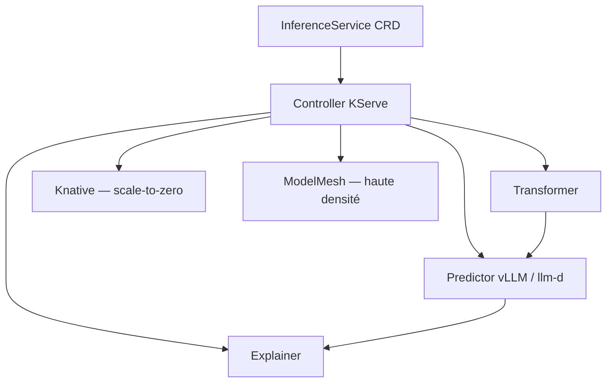

# kserve/kserve

> Plateforme Kubernetes d'inférence qui unifie le service de modèles prédictifs et génératifs.

## Le problème
Servir un modèle sklearn et servir un LLM demandent aujourd'hui deux piles différentes, deux façons d'autoscaler, deux protocoles.
Sur Kubernetes, chacun finit par réécrire son Deployment, son routage et son scale-to-zero.

## Ce que ça fait vraiment
Un CRD unique, l'`InferenceService`, décrit le modèle ; KServe déploie predictor, transformer et explainer et route les requêtes entre eux.
Côté génératif : backends vLLM et llm-d, protocole compatible OpenAI, cache de modèles, déchargement du KV cache vers CPU/disque, autoscaling à la requête.
Côté prédictif : TensorFlow, PyTorch, scikit-learn, XGBoost, ONNX, déploiements canari, `InferenceGraph` pour les pipelines et ensembles, scale-to-zero.
Le monitoring couvre le logging de payload, la détection d'outliers, d'adversarial et de dérive.

## Comment c'est branché


## Essayer
Aucune commande d'installation n'est donnée dans le README : il renvoie vers quatre chemins documentés sur le site (Standard Kubernetes, Knative, ModelMesh, Quick Installation) et vers l'addon Kubeflow.

```bash
# aucune commande documentée dans le README — voir la documentation du site KServe
```

## Coût et pièges
Gratuit, mais il faut un cluster Kubernetes et des GPU pour la partie générative : la facture est celle de l'infra.
L'installation « Standard Kubernetes », plus légère, perd le canari et l'autoscaling à la requête avec scale-to-zero ; ces deux-là imposent Knative.

## Ce que ce n'est pas
Ce n'est pas un moteur d'inférence : vLLM et llm-d font le travail, KServe orchestre. Ce n'est pas utilisable sans Kubernetes, ni sur un poste de dev.
Et ce n'est pas un projet CNCF diplômé — il est en incubation, ce qui laisse encore bouger les API.

## Alternatives
- ModelMesh : cité comme composant optionnel pour les cas haute densité / modèles changeant souvent.
- Kubeflow : si tu veux la plateforme ML complète plutôt que la seule brique de service.
- vLLM : cité comme backend, suffisant tant qu'un seul modèle tourne sur une machine.

## Pour toi
La brique de référence si tu sers déjà sur Kubernetes et que tu veux arrêter de maintenir deux piles, prédictive et générative.
