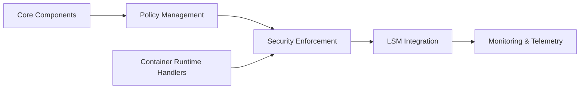

# kubearmor/KubeArmor

> Système de sécurité d'exécution qui restreint processus, fichiers et réseau des pods et nœuds via LSM et eBPF.

## Le problème
Un conteneur compromis peut lancer des processus ou lire des fichiers sensibles ; les règles réseau seules ne suffisent pas.

## Ce que ça fait vraiment
Applique des politiques (liste blanche de processus, accès fichiers, réseau) via AppArmor, SELinux ou BPF-LSM, et produit des alertes avec identité de conteneur, pod et namespace grâce à eBPF. Déploiement Kubernetes, conteneur ou VM. Politiques : pod, cluster, hôte. Projet Sandbox de la CNCF.

## Comment c'est branché

## Essayer
Aucune commande dans le README ; il renvoie à un guide « Getting Started » et à l'outil `karmor`.

## Coût et pièges
Demande un noyau avec LSM/eBPF compatible (matrice de support à consulter). 412 issues ouvertes. Le README contient un TODO interne sur la gouvernance des sous-projets.

## Ce que ce n'est pas
Ce n'est pas un scanner de vulnérabilités : il applique des règles à l'exécution. Il ne protège pas les modèles ML en soi (le dépôt modelarmor est séparé).

## Alternatives
Aucune alternative nommée dans le README.

## Pour toi
À surveiller : utile si tes charges IA tournent sur Kubernetes partagé et que la sécurité d'exécution compte ; sinon hors périmètre.
