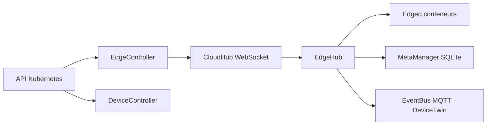

# kubeedge/kubeedge

> Extension de Kubernetes qui porte l'orchestration de conteneurs et de devices jusqu'à l'edge.

## Le problème
Les nœuds de périphérie ont un réseau instable et peu de ressources : un kubelet standard n'y
survit pas, et les devices MQTT n'ont pas de place dans l'API Kubernetes.

## Ce que ça fait vraiment
Sépare une partie cloud et une partie edge. Côté cloud, CloudHub (serveur WebSocket),
EdgeController et DeviceController étendent Kubernetes pour cibler un nœud edge précis. Côté
edge, EdgeHub dialogue avec le cloud, Edged gère les conteneurs, EventBus parle MQTT, ServiceBus
expose du HTTP local, DeviceTwin stocke l'état des équipements et MetaManager persiste les
métadonnées en SQLite. Résultat : les nœuds continuent de fonctionner hors ligne, même après
redémarrage, et les devices se pilotent par CRD.

## Comment c'est branché


## Essayer
```bash
# Aucune commande documentée dans le README : il renvoie au « get started » et
# au site kubeedge.io, ainsi qu'au répertoire examples.
```

## Coût et pièges
Gratuit, projet **gradué** à la CNCF, avec un audit de sécurité tiers de juillet 2022 et un
papier d'analyse de menaces publiés. Le point d'attention réel est la compatibilité : la table
du README fixe précisément quelle version de KubeEdge va avec quelle version de Kubernetes
(1.27 à 1.32), et sortir de cette grille casse des API.

## Ce que ce n'est pas
Ce n'est pas une distribution Kubernetes autonome : il s'appuie sur un cluster existant. Ce n'est
pas un broker MQTT — il en utilise un (mosquitto). Ce n'est pas un outil d'IA embarquée, même si
le README cite le déploiement de modèles comme cas d'usage.

## Alternatives
Aucune alternative nommée dans le README.

## Pour toi
Pertinent seulement si tu déploies des modèles sur du matériel de terrain ; sinon hors sujet.
