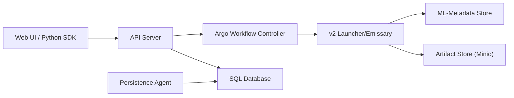

# kubeflow/pipelines

> Service d'orchestration de workflows de machine learning sur Kubernetes, pour équipes MLOps.

## Le problème
Enchaîner préparation de données, entraînement et évaluation de façon répétable, avec suivi des expériences, exige une plateforme qui exécute chaque étape dans un conteneur.

## Ce que ça fait vraiment
Le SDK Python décrit des pipelines réutilisables ; le compilateur v2 les traduit en workflows Argo. Un serveur d'API (gRPC et HTTP) stocke pipelines et runs dans une base SQL. Argo lance un pod par tâche (exécuteur Emissary). Un agent de persistance suit les workflows et écrit leur état ; les métadonnées passent par ML-Metadata et les artefacts par un stockage objet (Minio). Une interface web, un service de cache et des contrôleurs de CRD complètent l'ensemble.

## Comment c'est branché


## Essayer
```bash
just
just backend-test
just backend-images
```
Ces recettes servent au développement du projet ; l'installation passe par la documentation officielle, non reproduite dans le README.

## Coût et pièges
Il faut un cluster Kubernetes, Argo Workflows (v3.7 ou v4.1) et MySQL 8. Le README prévient que KFP 3.0 n'acceptera plus Argo 3.x : mettre Argo en 4.x avant de migrer. Le lien DeepWiki est généré par IA et peut être inexact.

## Ce que ce n'est pas
Ce n'est pas un outil léger à lancer sur un poste : il suppose Kubernetes et plusieurs composants à exploiter. Ce n'est pas non plus une plateforme complète de MLOps : le suivi de modèles et le serving relèvent d'autres briques du projet Kubeflow.

## Alternatives
Aucune alternative citée dans le README (Argo Workflows y est le moteur sous-jacent, pas un concurrent).

## Pour toi
À adopter si ton équipe a déjà Kubernetes et veut un orchestrateur ML établi (2018, activité en septembre 2026) ; sans cluster, le coût d'exploitation dépasse le bénéfice.
