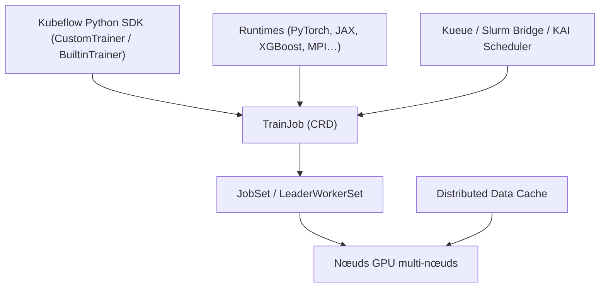

# kubeflow/trainer

> Plateforme Kubernetes native pour l'entraînement distribué et le fine-tuning de LLM.

## Le problème
Lancer un entraînement multi-nœuds multi-GPU sur Kubernetes demande d'assembler soi-même
l'orchestration, la communication MPI et le streaming des données vers les GPU.

## Ce que ça fait vraiment
Expose deux API — `TrainJob` et des `Runtimes` — pour PyTorch, MLX, HuggingFace, DeepSpeed,
Megatron-LM, JAX et XGBoost. Apporte MPI sur Kubernetes pour la synchronisation rapide entre
nœuds GPU. Réutilise les briques natives JobSet et LeaderWorkerSet plutôt que de réinventer
l'orchestration. Fournit un cache de données distribué qui streame en zéro-copie directement
vers les nœuds GPU. S'intègre à Kueue (ordonnancement topologique, dispatch multi-cluster),
au Slurm Bridge (clusters hybrides Kubernetes/Slurm) et à KAI Scheduler. Un SDK Python Kubeflow
permet le développement et l'exécution locale PyTorch.

## Comment c'est branché

## Essayer
Aucune commande documentée : le README renvoie à la documentation officielle Kubeflow Trainer
pour l'installation et la prise en main.

## Coût et pièges
Gratuit, mais suppose un cluster Kubernetes et des GPU. Le projet se déclare explicitement en
**statut alpha, avec des API susceptibles de changer**. Si tu es sur Training Operator V1, la
migration est un chantier à part : le code V1 reste maintenu sur la branche `release-1.9`.

## Ce que ce n'est pas
Ce n'est pas un framework d'entraînement : il orchestre PyTorch, JAX et les autres, il ne les
remplace pas. Ce n'est pas non plus Kubeflow Pipelines. Et ce n'est pas la V1 du Training
Operator, malgré le nom.

## Alternatives
- Kubeflow Training Operator V1, pour rester sur une API stable en attendant la sortie d'alpha.
- KubeRay, si ton runtime distribué est Ray plutôt que MPI/PyTorch.

## Pour toi
Le candidat naturel si tu construis une plateforme d'entraînement interne sur Kubernetes — en
acceptant l'alpha.
