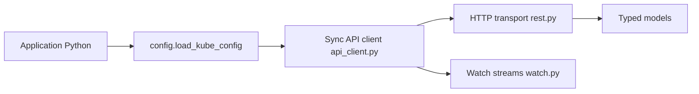

# kubernetes-client/python

> Client Python officiel de l'API Kubernetes, synchrone et asynchrone.

## Le problème
Piloter un cluster depuis du code Python sans écrire soi-même les appels REST.

## Ce que ça fait vraiment
Charge une configuration (`load_kube_config`), expose les groupes d'API typés (CoreV1Api…), supporte asyncio, les watches, les informers, le client dynamique et la création de ressources depuis YAML. Le module `stream` gère exec/attach.

## Comment c'est branché


## Essayer
```bash
pip install kubernetes
python -m examples.example1
```

## Coût et pièges
Gratuit, mais il faut un cluster et un kubeconfig. Le versionnement suit Kubernetes (vY.Z.P). Piège exec/attach : utiliser `stream` et recréer le client ensuite.

## Ce que ce n'est pas
Pas un outil de déploiement : il appelle l'API, rien de plus.

## Alternatives
Aucune alternative nommée dans le README.

## Pour toi
À adopter dès que tu automatises du MLOps sur Kubernetes en Python : client officiel, activité récente, licence Apache-2.0.

