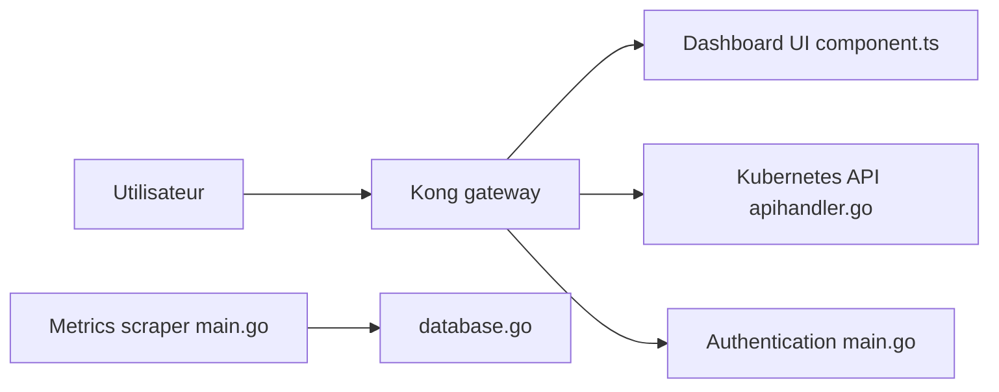

# kubernetes-retired/dashboard

> Interface web généraliste pour administrer un cluster Kubernetes, désormais archivée au profit de Headlamp.

## Le problème
Voir et dépanner les workloads d'un cluster sans tout faire en `kubectl`.

## Ce que ça fait vraiment
Interface web : workloads, ressources de cluster, découverte, config et stockage, logs, shell dans un conteneur, création de ressources, vues de CRD avec YAML/JSON brut. Depuis la 7.0.0 : installation par Helm uniquement, avec une passerelle Kong et plusieurs conteneurs (UI, API, authentification, scraper de métriques).

## Comment c'est branché


## Essayer
```bash
helm repo add kubernetes-dashboard https://kubernetes.github.io/dashboard/
helm upgrade --install kubernetes-dashboard kubernetes-dashboard/kubernetes-dashboard --create-namespace --namespace kubernetes-dashboard
```

## Coût et pièges
Gratuit, mais plus maintenu : pas de correctifs de sécurité à attendre. Exposer une UI d'admin de cluster demande un contrôle d'accès soigné.

## Ce que ce n'est pas
Pas maintenu, pas un outil d'observabilité. Le README renvoie vers Headlamp.

## Alternatives
- Headlamp : cité par le README, repris sous sig-ui, donc maintenu.

## Pour toi
À ignorer : archivé en janvier 2026, le README lui-même oriente vers Headlamp ; ne pas bâtir une plateforme MLOps dessus.

