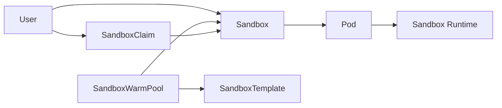

# kubernetes-sigs/agent-sandbox

> CRD Kubernetes pour des bacs à sable isolés, persistants et à identité stable, pensés pour les agents.

## Le problème
Un runtime d'agent veut un conteneur unique, durable, joignable par un nom stable.
Les Deployments et StatefulSets n'y répondent qu'en les détournant, sans hibernation ni reprise.

## Ce que ça fait vraiment
La CRD `Sandbox` gère un pod unique avec identité réseau stable, stockage persistant, pause et reprise.
Les extensions ajoutent `SandboxTemplate` (modèles réutilisables), `SandboxClaim` et `SandboxWarmPool`.
Le pool préchauffé réduit le délai d'obtention d'un bac à sable, utile en boucle d'entraînement ou d'évaluation.
L'isolation forte est déléguée à des runtimes tiers via `RuntimeClass` : gVisor, Kata Containers.

## Comment c'est branché


## Essayer
```sh
kubectl apply -f https://github.com/kubernetes-sigs/agent-sandbox/releases/latest/download/sandbox-with-extensions.yaml
pip install k8s-agent-sandbox
```

## Coût et pièges
Il faut un cluster Kubernetes et, pour l'isolation réelle, installer gVisor ou Kata séparément.
Supprimer les CRD supprime en cascade toutes les ressources associées, dans tous les namespaces.

## Ce que ce n'est pas
Pas un moteur d'isolation : il orchestre des runtimes qui, eux, isolent.
Pas un service géré ni une offre de bac à sable clés en main.
Le routeur HTTP est optionnel et se déploie à part.

## Alternatives
StatefulSet de taille 1 avec Service et PVC : l'approximation que le projet dit vouloir remplacer.

## Pour toi
La bonne brique si tu dois exécuter du code généré par un LLM sur un cluster ; sinon attendre la maturité.
