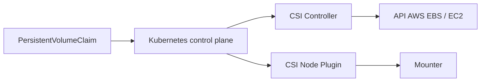

# kubernetes-sigs/aws-ebs-csi-driver

> Pilote CSI qui provisionne et gère les volumes et snapshots EBS d'AWS pour Kubernetes.

## Le problème
Les pods ont besoin de volumes persistants EBS sans les créer et attacher à la main.

## Ce que ça fait vraiment
Implémente la spec CSI (v1.9.0) : provisionnement statique et dynamique via StorageClass, volumes bloc bruts, snapshots, redimensionnement, modification de type/IOPS/débit via `VolumeAttributesClass`, volumes locaux au nœud. Composants : controller, node, identity ; appelle les API EC2 et le mounter Linux/Windows. Livraisons mensuelles, chart Helm.

## Comment c'est branché

## Essayer
Le README ne contient aucune commande d'installation ; il renvoie à la doc « Driver Installation » et au chart Helm (registry.k8s.io/provider-aws/charts/aws-ebs-csi-driver).

## Coût et pièges
Volumes EBS facturés par AWS ; permissions IAM nécessaires ; compatible avec les versions Kubernetes supportées, y compris EKS étendu.

## Ce que ce n'est pas
Pas un stockage partagé multi-nœuds (EBS est attaché à une zone/instance). Ne fonctionne qu'avec AWS.

## Alternatives
Le README ne cite aucune alternative.

## Pour toi
À adopter si tes workloads ML tournent sur EKS et ont besoin de disques persistants : c'est la brique standard côté AWS.
