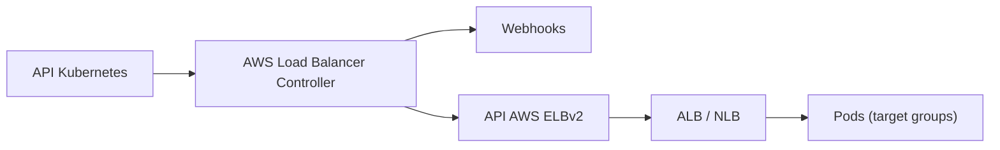

# kubernetes-sigs/aws-load-balancer-controller

> Contrôleur Kubernetes qui crée des load balancers AWS pour les Ingress, Services et Gateways.

## Le problème
Exposer des applications Kubernetes sur AWS demande de créer et synchroniser à la main des répartiteurs de charge.

## Ce que ça fait vraiment
Le README est très court. Il indique que le contrôleur satisfait les Ingress avec des Application Load Balancers, les Services avec des Network Load Balancers, et les Gateways avec les deux. D'après le diagramme, il réconcilie aussi des TargetGroupBindings et inclut des webhooks. Le détail est renvoyé à la documentation en ligne.

## Comment c'est branché


## Essayer
```bash
# Aucune commande documentée dans le README ; voir la documentation en ligne.
```

## Coût et pièges
Fonctionne sur AWS : les load balancers créés sont facturés par AWS, et le contrôleur demande des permissions IAM.

## Ce que ce n'est pas
Ne convient pas à un cluster hors AWS. Anciennement « AWS ALB Ingress Controller ».

## Alternatives
Aucune alternative nommée dans le README.

## Pour toi
À ignorer sauf si tu exploites toi-même un cluster Kubernetes sur AWS : c'est de l'infrastructure réseau, pas un outil data/IA.
