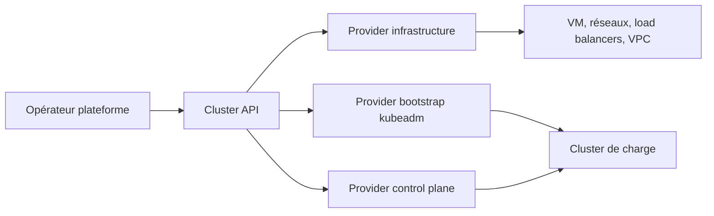

# kubernetes-sigs/cluster-api

> API déclarative Kubernetes pour provisionner, mettre à jour et opérer plusieurs clusters.

## Le problème
Créer et faire vivre plusieurs clusters Kubernetes se fait à la main, différemment chez chaque fournisseur.
Rien ne garantit qu'un cluster reproduit ailleurs soit le même.

## Ce que ça fait vraiment
Un sous-projet Kubernetes qui expose la gestion du cycle de vie des clusters via des APIs de style Kubernetes.
L'infrastructure support — machines virtuelles, réseaux, répartiteurs de charge, VPC — est décrite au même endroit.
La configuration du cluster se déclare comme un opérateur déclare un déploiement applicatif.
Extensible par providers : infrastructure (AWS, Azure, vSphere…), bootstrap et control plane, kubeadm étant intégré.

## Comment c'est branché

## Essayer
Aucune commande documentée dans le README : il renvoie au Quick Start du livre du projet.

## Coût et pièges
Rien à payer côté projet, mais l'infrastructure provisionnée chez le fournisseur est à ta charge.
Il faut un cluster de gestion et le provider correspondant à ta cible, installés séparément.

## Ce que ce n'est pas
Pas un installeur mono-cluster ni un remplaçant de kubeadm : il l'orchestre.
Pas une couche applicative — rien sur les charges qui tournent dans les clusters créés.
Le README est une porte d'entrée ; toute la matière est dans le livre externe.

## Alternatives
Aucune alternative nommée dans le README.

## Pour toi
Pertinent seulement si tu opères une flotte de clusters ; sinon c'est de la plomberie d'infra pure.
