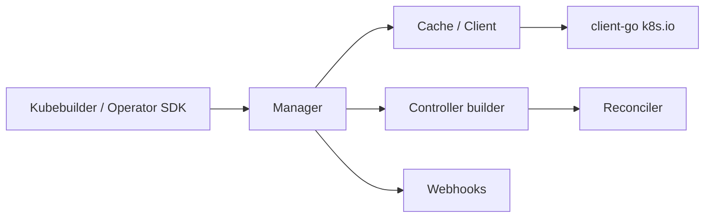

# kubernetes-sigs/controller-runtime

> Bibliothèques Go pour écrire des contrôleurs Kubernetes, socle de Kubebuilder et de l'Operator SDK.

## Le problème
Écrire un contrôleur à la main veut dire recâbler informers, caches, files de travail et webhooks.
Aligner les versions de `client-go` et des dépendances `k8s.io/*` est un piège récurrent.

## Ce que ça fait vraiment
Fournit le manager, le builder de contrôleur, les caches et clients, et les designs associés.
Le versionnage est explicite : major bloqué à zéro, une version mineure par version mineure de
Kubernetes, ruptures autorisées entre mineures, aucune rupture en patch.
Un tableau de compatibilité donne, pour chaque mineure (CR v0.15 à v0.25), la version `k8s.io/*`
et `client-go` associée et la version minimale de Go (1.20 à 1.26).
Côté contributeurs, chaque PR doit être étiquetée `:bug:`, `:sparkles:` ou `:warning:`.

## Comment c'est branché

## Essayer
Aucune commande documentée dans le README : il renvoie au Quick Start de Kubebuilder et aux exemples.

## Coût et pièges
Gratuit. La compatibilité `client-go` hors de la paire testée est « par chance, ni supportée ni testée ».
La version Go minimale suit celle des dépendances `k8s.io/*` ; la vérité est dans `go.mod`.
Les ruptures arrivent entre versions mineures, donc une montée de version de Kubernetes se paie.

## Ce que ce n'est pas
Ce n'est pas un framework complet pour démarrer un opérateur : le README oriente vers Kubebuilder
et l'Operator SDK pour les nouveaux projets. Ce n'est pas stable au sens sémantique : major zéro.
Ce n'est pas indépendant de Go.

## Alternatives
Kubebuilder et Operator SDK, tous deux cités comme meilleurs points de départ pour un projet neuf.

## Pour toi
À connaître de loin : tu la croiseras en dépendance transitive plus qu'en dépendance directe.
