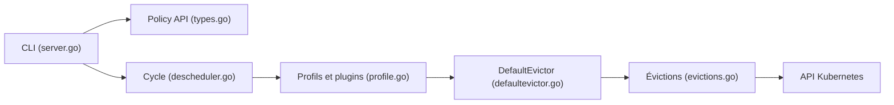

# kubernetes-sigs/descheduler

> Composant Kubernetes qui évince des pods déjà placés pour que le scheduler les replace mieux ; pour opérateurs de clusters.

## Le problème
Le scheduler décide une fois, au moment de la création du pod. Taints, labels, nœuds ajoutés ou sous-utilisés rendent ensuite le placement obsolète.

## Ce que ça fait vraiment
Selon une politique `DeschedulerPolicy`, il trouve des pods évictables et les évince ; il ne programme pas les remplaçants, le scheduler par défaut s'en charge. Plugins « deschedule » (violations d'affinité, taints, redémarrages, PodLifeTime, pods en échec) et « balance » (doublons, LowNodeUtilization, HighNodeUtilization, topologie). Un DefaultEvictor protège certains pods (critiques, DaemonSet, stockage local, PDB respecté). Il expose des métriques et peut lire Prometheus.

## Comment c'est branché


## Essayer
```bash
kubectl create -f kubernetes/base/rbac.yaml
kubectl create -f kubernetes/base/configmap.yaml
kubectl create -f kubernetes/cronjob/cronjob.yaml
```

## Coût et pièges
Gratuit, mais tourne dans `kube-system` avec droits d'éviction. Utiliser la doc de la branche de release correspondant à la version. Une éviction mal ciblée interrompt des charges (jobs, entraînements) : les PDB comptent.

## Ce que ce n'est pas
Ce n'est pas un scheduler. Il ne replace rien lui-même, et par défaut il se fonde sur les requests des pods, pas sur l'usage réel (sauf métriques configurées).

## Alternatives
Non documenté dans le README : aucune alternative nommée.

## Pour toi
Pertinent si tu gères des clusters Kubernetes pour des charges ML mixtes et veux compacter ou rééquilibrer des nœuds ; sinon à ignorer côté data science pure, mais prudence sur les pods d'entraînement évincés.

